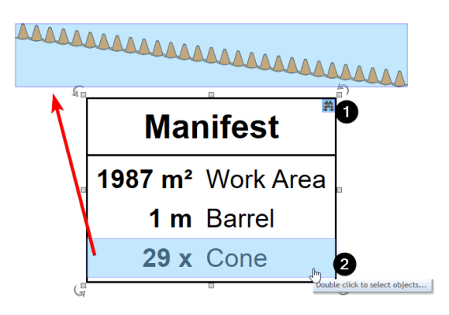
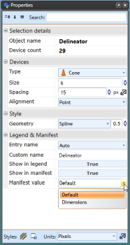

## The Manifest Box 

The Manifest Box works similarly to the Legend Box. The difference is, when you set an item to appear in the manifest box, if it has the relevant dimension, you can set the **Manifest Value** to either the dimensions or the number count (considered the default). And like Legend Box, Manifest Box can be used to trace entries back to the actual on-plan objects they represent.

As you can see in the example below, the **Cones** Manifest Value is set to show the number count and the **Work Area** and **Barrel** is set to show the dimensions.

Below is an example of a delineator being set to **Show in Manifest** and selecting the **Manifest Value**.

