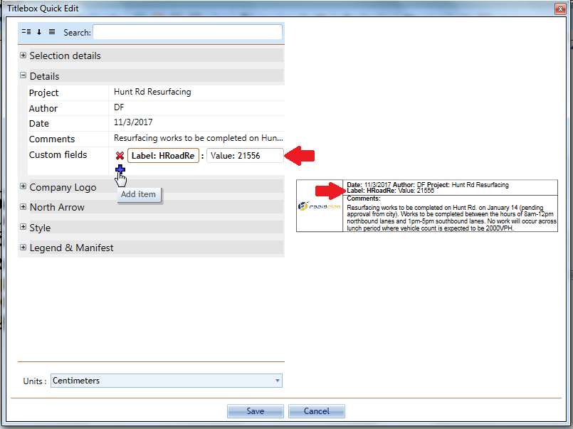

## Custom Details

Because we don't know every field, you are likely to need, we have included a custom details field where you can give your plan a **Label** and a **Value**. 

Naming the fields is simple, first click on the **Add** icon  and enter the appropriate values for **Label** and **Values** as shown below, then click **Save**.

**Note**: Instead of entering Label and Value text, you can also delete the words Label and Value and enter your own custom information.
