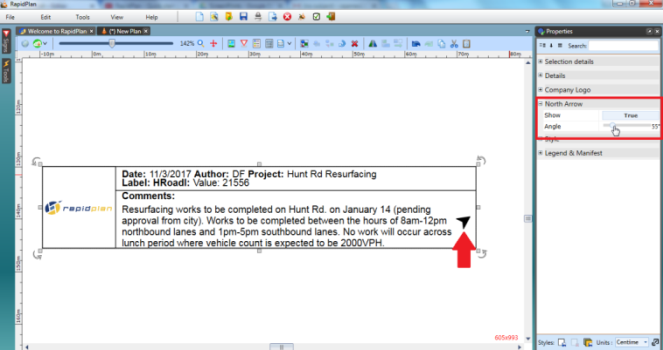

## The North Marker

The north marker is a handy tool to give your audience an idea of the plan orientation. Its also very easy to use.

In the North Arrow tab of the Properties, simply click on the **Show** section to make it **True**, then adjust the direction of the arrow with the **Angle** bar as shown below.

