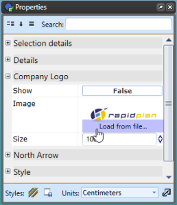

## The Logo Placeholder

An added hint of professionalism (and identification) is achieved by adding a logo to your plan. 

You will need to have a high quality logo, preferably in **JPG**, **BMP** or **PNG** format.

**To include the logo on a title box:**

 - Click on the **Company Logo** tab in Properties. 
 - Hover your cursor over the **Image** section until the option to **Load File From** becomes visible. Select this.
 - Browse for your image files on your computer, double click on your file once you've found it.
 - Do not forget to make the **Show** section **True** to make your logo visible in the Title Box.

    
