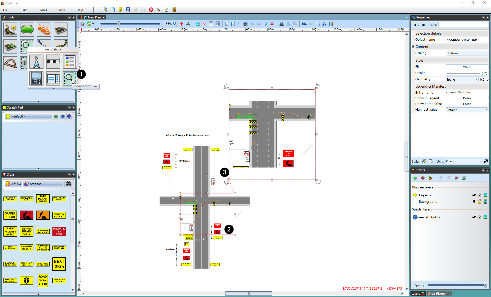

## Creating Zoomed View Box

1. Select the **Zoomed View Box** tool from the Annotations tab in the Tools Palette

2. Select the area you want to enlarge

3. Set the place where you want to put zoomed box

4. Set the size of box

    
