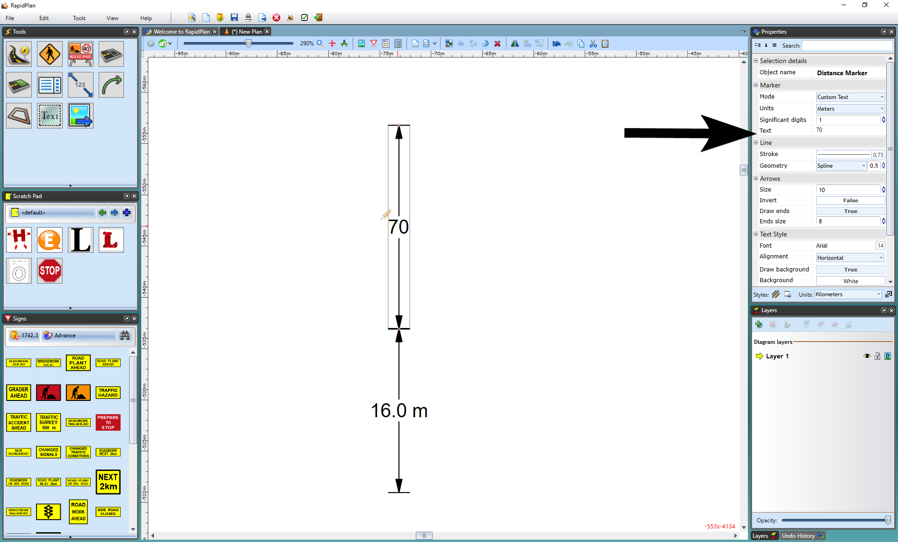

## Changing the Distance on the Marker

 - Select the Marker
 - Double click on the distance number provided
 - The writing cursor will appear and will allow you to enter your desired distance
 - Click anywhere on your plan to finish

    