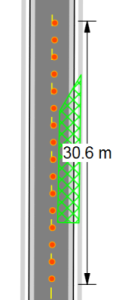
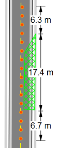
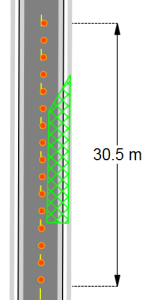

## The Six Distance Markers (part 1)

### Distance Marker

The Distance Marker calculates one distance.

### Combined Distance Marker 

This tool does the same as the Distance Marker but with the ability to show multiple distances as shown below. 

**To place a Combined Distance Marker:**

 - Select the **Combined Distance Marker** tool from the Marker tab in the Tools Palette.
 - Left click once to start drawing the distance marker, left click again to end the first distance marker and start the second
 - Repeat this until you have all of your distances marked for that marker
 - Right click to finish

 ### Offset Distance Marker 

This tool allows you to un-clutter items on your plan by being "offset" from its true location. 

**To place an Offset Distance Marker:**

 - Select the **Offset Distance Marker** tool from the Marker tab in the Tools Palette.
 - Click once to start drawing the distance marker, click a second time to mark the end point.
 - Drag your mouse laterally away from the distance
marker to set the offset. Click a third time to finish drawing the marker.
