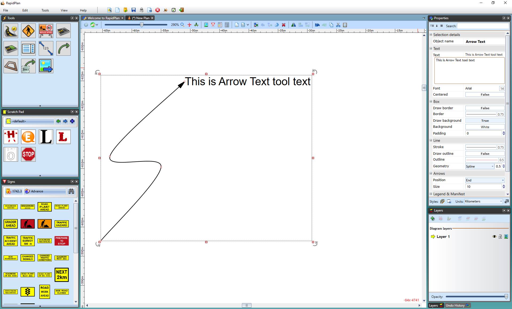

## Creating an Arrow Text 

 - Select the **Arrow Text** tool from the Text tab in the Tools Palette.
 - Click to place the head of the arrow.
 - Click again for each subsequent turn point that you require.
 - When you have placed your final point, Right click and a text cursor will appear for you to write your text in (**Note**: This can be edited in the Properties Palette).

    

    **Note**: To create a straight arrow, hold **SHIFT** whilst drawing the arrow.