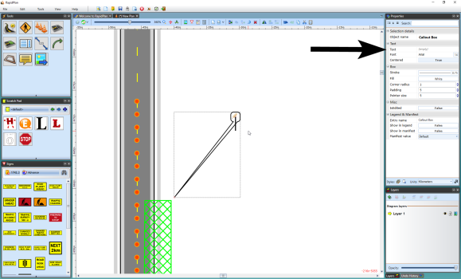

## Callout Boxes 

The Callout box is a great way to draw attention to important items on your plan that need to be noticed. They look great and are simple to use. You can change their color, shape, fill style and text type to make your message clearly stand out.

## Creating a Callout Box

 - Select the Callout box from the Text tab in the Tools Palette.
 - Click on the plan where you want to place the pointer of the callout box.
 - Move the mouse to where you wish to place the body of the callout and click again.
 - A text cursor will appear for you to write your text in the box (see below).
 - Click anywhere on your plan to complete the callout box.

    

## Other Callout Properties 
If you want your callout to stand out ever more, or have some sort of coding that you would like to apply on your plans, you can also change the fill type and color, stroke and color.

Refer to the Properties Palette to edit your callout box with more editing tools.