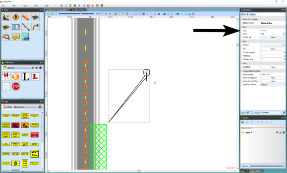

## Creating a Callout Box

 - Select the Callout box from the Text tab in the Tools Palette.
 - Click on the plan where you want to place the pointer of the callout box.
 - Move the mouse to where you wish to place the body of the callout and click again.
 - A text cursor will appear for you to write your text in the box (see below).
 - Click anywhere on your plan to complete the callout box.

    