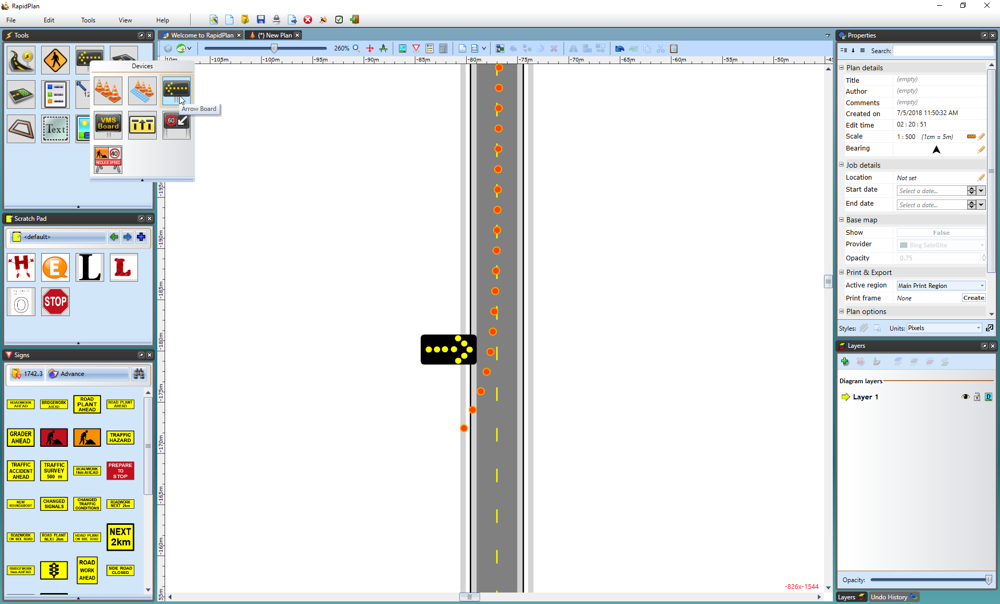
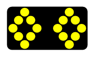

## The Arrow Board 

They come by many names, flashing arrow boards, sequential arrow boards, arrow trailers or even illuminated trailer mounted sequential flashing arrow systems. In RapidPlan they are referred to as Arrow Boards. They are simple to place and use and come with various configurations for the required site setting.

There are six different Arrow Board patterns available in RapidPlan:

|Patterns                                     |           |                                             |           |
|---------------------------------------------|-----------|---------------------------------------------|-----------|
|    | Single    |    | Double    |
|   | Warning   || Cautionary|
|   | Chevron   |  | Diamonds  |
 

