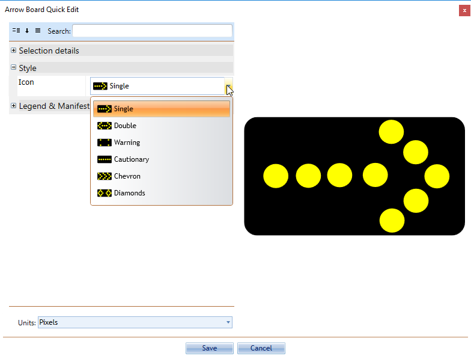

## Changing the Pattern on the Arrow Board

 - Double click on the Arrow Board placed on your plan to enter the Quick Edit screen.
 - From the Board tab set the desired pattern from the Style tab and click on the Icon drop-down box.

    
