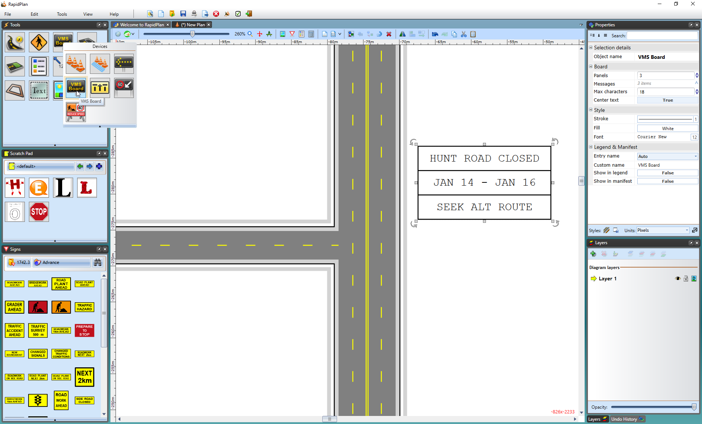

## The Layout of the VMS Board

In order to conserve space on the plan, the VMS Board is organized with one line for each frame as shown below.

On the roadway, the top line would occupy the first frame, the middle the second and so on. The VMS Board may take up  many different panels (although in many jurisdictions, VMS message sequences are mandated as being less than five panels).