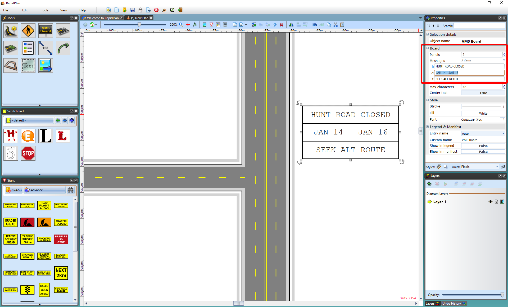

## Creating a VMS Board 

 - Select the **VMS Board** from the Devices tab in the Tools Palette and place the panel in the desired location on the plan.
 - Set the number of panels (or frames) using the **Panels** section of the Properties Palette.
 - Enter the text for each frame in the Messages section of the Properties Palette.
 - Deselect the VMS board to finish.

    