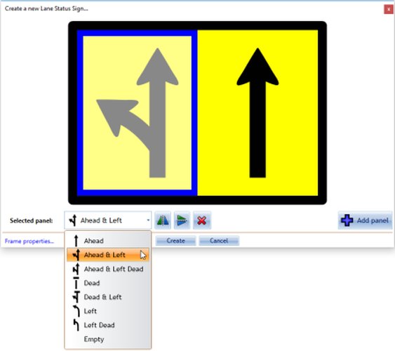

## The Lane Status Wizard

Upon selecting the Lane Status tool, a wizard box will open where you can make all necessary changes to lane status situations. Within the wizard there are several status arrow options to choose from and multiple lane signs can be added as shown below.

