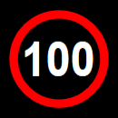
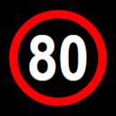
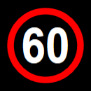
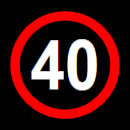

## LUMS Board (Australian Version Only) 
This tool helps you create a Lanes Use Management System (LUMS) across a roadway on your plan. There are 10 different LUMS styles available for your plan.

|Patterns                               |           |                                                   |               |
|---------------------------------------------------|-----------|---------------------------------------------------|---------------|
|        | 100 km/h  |         | 80 km/h       |
|         | 60 km/h   |         | 40 km/h       |
| | Merge left|| Merge right   |
|  | Exit left | | Exit right    |
|      | Cross     |      | Blank         |
:::

