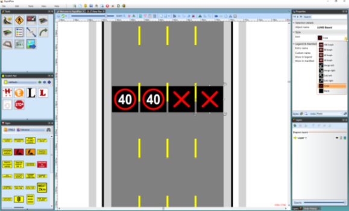

## Creating an LUMS Board 

 - Select the **LUMS Board** tool in the Devices tab in the Tools Palette.
 - Click once to place an LUMS Board the first lane, continue this for each lane.
 - Once all of your LUMS Boards are set, you can select each one and change its style in the Properties Palette under the **Style** tab and the **Icon** drop down menu.
 - Right click to finish

    