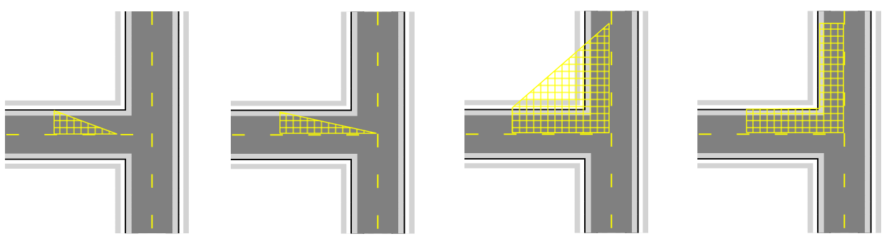

## Creating a Work Area and Safety Zone on a plan

Both tools are simple polygons that are drawn on the plan. Aside from the way they look they both behave identically.

_and_Safety_Area_(Yellow)_on_a_Plan.png)

**To place a Work Area or Safety Zone on a plan:**

 - Select the appropriate tool from the Zones tab in the Tools Palette.
 - Click at the first corner point of your required area and continue clicking to set corner points (see below).
 - When the final point is placed, right click to stop drawing.
 - Right click to clear the cursor.

    