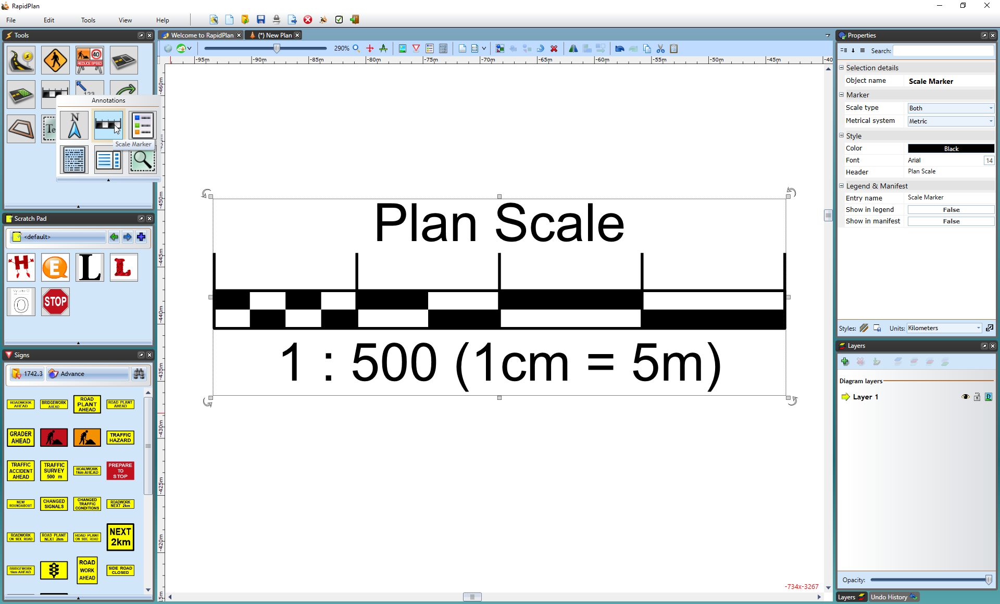

## To place a Scale Marker

 - Select the Scale Marker from the Annotations tab in the Tools Palette.
 - Click once anywhere on your plan to place the marker.
 - Edit the values for the marker within the Properties Palette.

    