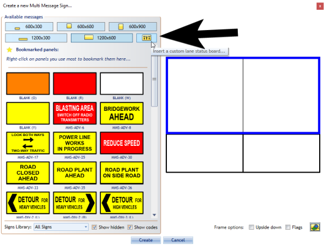
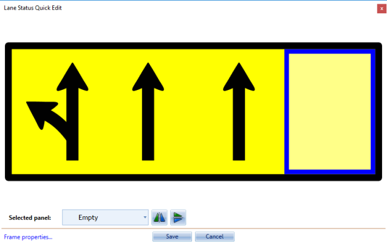
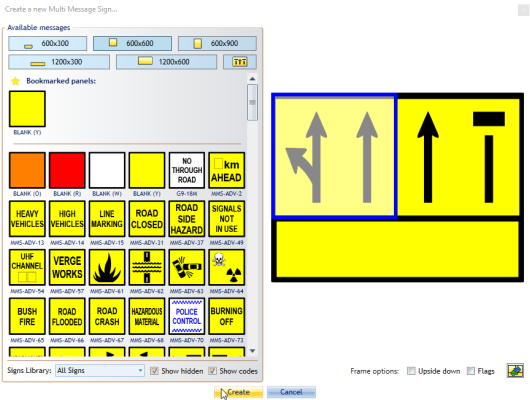

---

sidebar_position: 12

---
# Adding a Lane Status Sign to your Multi Message Marker

You can also add a Lane Status sign to your Multi Message sign in the 600x600 size for two lanes, or 1200x600 size for four lanes.

**Adding a Lane Status to you Multi Message sign:**

- Select the desired size depending on number of lanes.
- Select the Lane Status Icon (see below).
- You will be directed to select a Lane Status Arrow for each lane.
- Select **Save** and complete your Multi Message Sign and select **Create**.

    

    

    
