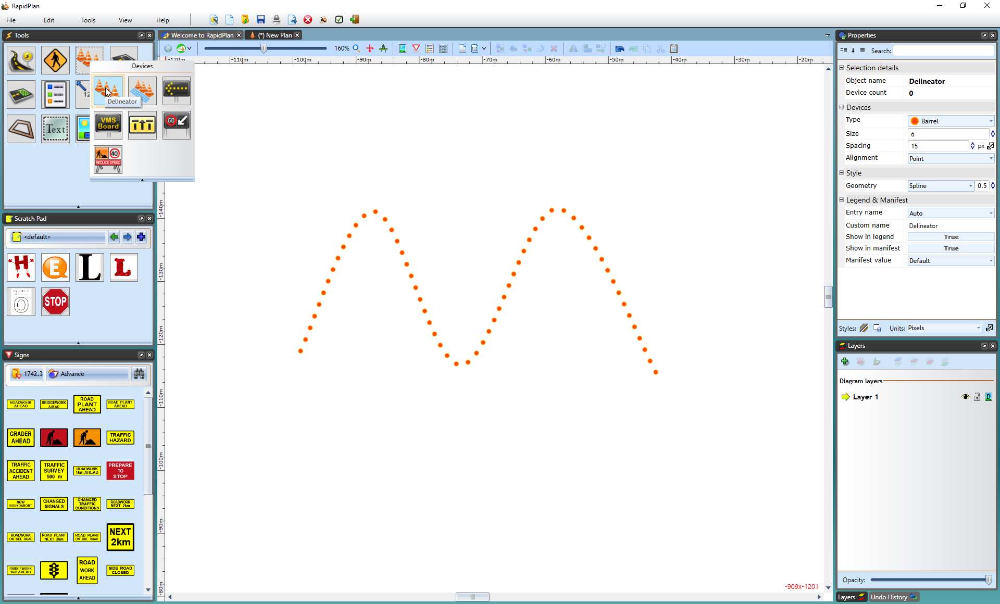

---

sidebar_position: 2

---
# Creating a Basic Delineator Line 

All delineator lines start by default as Barrels with a size of 6 units and a spacing of 30 units. They can then be changed into the required type after placement on the plan. You can also set new default values from the Properties palette.

**To create a basic delineator line:**

 - Select the Delineator from the Devices tab in the Tools Palette.
 - Click once where you wish to start drawing (don't hold).
 - Click at each corner for your line.
 - After you have placed the end point, right click to stop drawing.
 - Right click to clear the cursor.

    