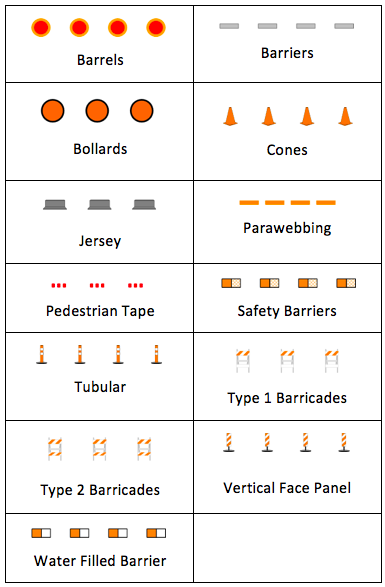

---

sidebar_position: 1

---
# Delineators

Traditionally, one of the most difficult things to do when creating a traffic plan was run out lines of bollards, cones, barrels, etc. The RapidPlan delineator tool allows you to drag out lines of devices in seconds. 

**Types of delineators available:**

There are thirteen standard types of delineators available:

