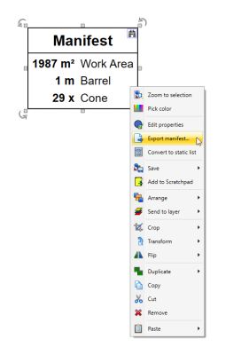

---

sidebar_position: 18

---
# Export Manifest Tool

The Export Manifest Tool allows you to create manifest documents based on one or more traffic control plans, then print or export to a range of formats: PDF, Text, CSV, XML and JSON. Access the export tool by right clicking on a **Manifest Box**, or via **File** > **Export** > **Batch Export** > **Export batch manifest...**

Step 1:

- Right click on Manifest and select **Export manifest...**

    

Step 2:

- Order manifest items (by name, by value or custom/manually)
- Set the units
- Set document header (and optional custom description)
- Select export format

    

And this is an example of exported manifest to PDF

