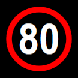
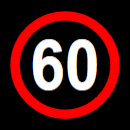
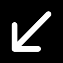
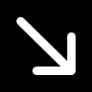
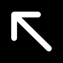
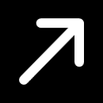
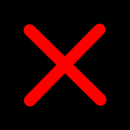

---

sidebar_position: 5

---
# LUMS Board (Australian Version Only)

This tool helps you create a Lanes Use Management System (LUMS) across a roadway on your plan. There are 10 different LUMS styles available for your plan.

|Patterns                               |           |                                                   |               |
|---------------------------------------------------|-----------|---------------------------------------------------|---------------|
|        | 100 km/h  |         | 80 km/h       |
|         | 60 km/h   |         | 40 km/h       |
| | Merge left|| Merge right   |
|  | Exit left | | Exit right    |
|      | Cross     |      | Blank         |

## Creating an LUMS Board

- Select the **LUMS Board** tool in the Devices tab in the Tools Palette.
- Click once to place an LUMS Board the first lane, continue this for each lane.
- Once all of your LUMS Boards are set, you can select each one and change its style in the Properties Palette under the **Style** tab and the **Icon** drop down menu.
- Right click to finish

    
