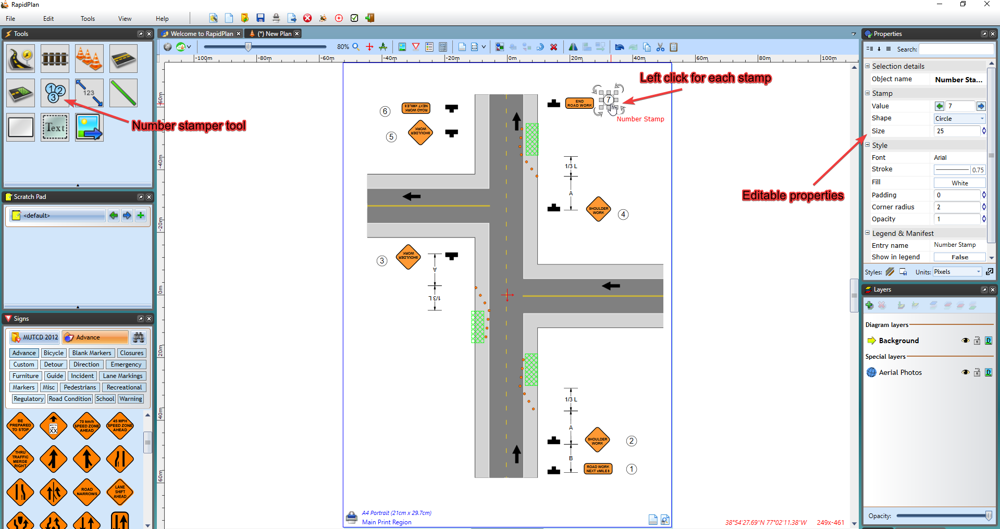

---

sidebar_position: 19

---
# Number stamper

Use the number stamper to quickly annotate objects on your traffic control plan.

To use the number stamper it's just a matter of clicking the Number stamper tool, located under Annotations, in the Tools palette.

Once selected, you can then annotate objects on your plan, by left clicking next to each object in sequence (e.g., 1, 2, 3, 4)
       
This tool can be useful for labelling devices on your plans, numbering project stages/phases, etc. The Properties of the stamper are also editable, enabling you to alter it's design and value - as shown in Figure 9.35 below. 

