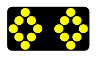

---

sidebar_position: 2

---
# The Arrow Board

They come by many names, flashing arrow boards, sequential arrow boards, arrow trailers or even illuminated trailer mounted sequential flashing arrow systems. In RapidPlan they are referred to as Arrow Boards. They are simple to place and use and come with various configurations for the required site setting.

There are six different Arrow Board patterns available in RapidPlan:

|Patterns                                     |           |                                             |           |
|---------------------------------------------|-----------|---------------------------------------------|-----------|
|    | Single    |    | Double    |
|   | Warning   || Cautionary|
|   | Chevron   |  | Diamonds  |

## Placing an Arrow Board

- Select the Arrow Board from the Devices tab in the Tools Palette.
- Drop it into position on the plan.
- Rotate it as necessary. **Note**: by default it appears as a Right flash - if you require a left flash, use
**CTRL + R** (twice) to change its orientation.

## Changing the Pattern on the Arrow Board

- Click on the Arrow Board placed on your plan to view its properties in the properties palette.
- From the Icon tab set the desired pattern from the Style tab and click on the Icon drop-down box.

    
