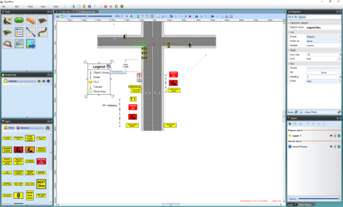
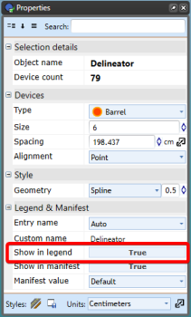
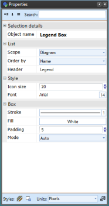

---

sidebar_position: 10

---
# The Legend Box

This tool enables you to place a legend box on your plan. There is a **Legend & Manifest** tab in every item's properties allowing you to select to show the item on the legend. Legend Box can be used to trace entries back to the actual on-plan objects they represent.

## Creating a Legend Box

- Select the **Legend** Tool from the Annotations tab in the Tools Palette
- Place this in the desired location on your plan
- Select an item on your plan that you want to appear in the Legend Box by clicking on it once
- Under the **Legend & Manifest** tab in the Properties Palette make sure the **Show in Legend** section is set to **True**
- Do this for any other items on your plan you wish to appear in the legend

**Note**: The legend box does not need to be visible on the plan for you to set an item to appear in the legend box. Therefore, you can set any item to **Show in Legend** as you build your plan and place the complete legend box at the end.

In the example below, a delineator has been set to **True**, so it will appear in the legend.

## Changing the Legend's Properties

Like any other item in RapidPlan, the Legend can be customized through the Properties Palette, including title, size, color, etc. as you can see below.

