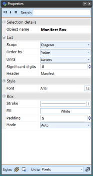
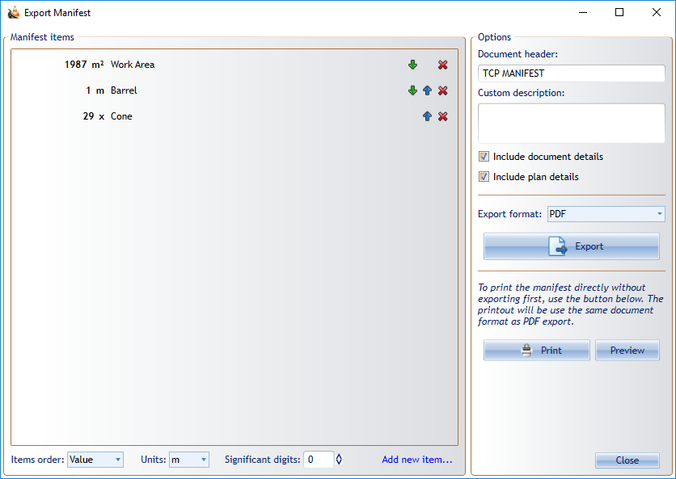
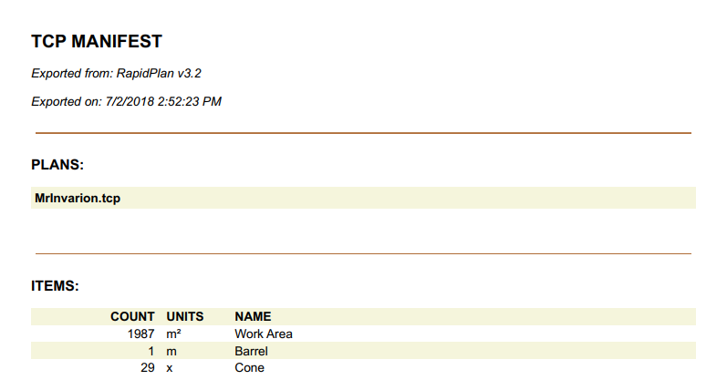

---

sidebar_position: 11

---
# The Manifest Box

The Manifest Box works similarly to the Legend Box. The difference is, when you set an item to appear in the manifest box, if it has the relevant dimension, you can set the **Manifest Value** to either the dimensions or the number count (considered the default). And like Legend Box, Manifest Box can be used to trace entries back to the actual on-plan objects they represent.

As you can see in the example below, the **Cones** Manifest Value is set to show the number count and the **Work Area** and **Barrel** is set to show the dimensions.

Below is an example of a delineator being set to **Show in Manifest** and selecting the **Manifest Value**.

## Changing the Manifest Box's Properties

Below is an image of the Manifest Properties Palette, showing all of the features that can be adjusted.

## Export Manifest Tool

The Export Manifest Tool allows you to create manifest documents based on one or more traffic control plans, then print or export to a range of formats: PDF, Text, CSV, XML and JSON. Access the export tool by right clicking on a **Manifest Box**, or via **File** > **Export** > **Batch Export** > **Export batch manifest...**

Step 1:

- Right click on Manifest and select **Export manifest...**

    

Step 2:

- Order manifest items (by name, by value or custom/manually)
- Set the units
- Set document header (and optional custom description)
- Select export format

    

And this is an example of exported manifest to PDF

