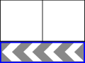
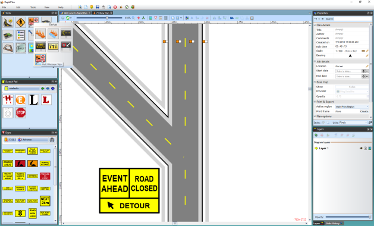

---

sidebar_position: 10

---
# The Multi Message Marker (Australian Version Only)

This marker operates very similar to the Lane Status marker in that it allows for the creation of one message board which displays multiple signs. The main difference between the two markers is that the Multi Message marker displays actual signs with messages as the marker implies, as opposed to only allowing for Lane Status signs to be used when working with the Lane Status marker.

There are five different sign sizes you can work with, each size tab will display the signs available within that size category.

|Image                                      |Sign size  |Available signs                                                                |
|-------------------------------------------|:---------:|-------------------------------------------------------------------------------|
| |600x300    |2 signs of this size can be used with one 1200x600 sign or two 600x600 signs.  |
| |600x600    |2 signs of this size can be used or one 1200x300 sign or two 600x300 signs.    |
| |600x900    |2 signs of this size can be used.                                              |
||1200x300   |1 sign of this size can be used with one 1200x600 sign or two 600x600 signs.   |
||1200x600   |1 sign of this size can be used with one 1200x300 sign or two 600x300 signs.   |

