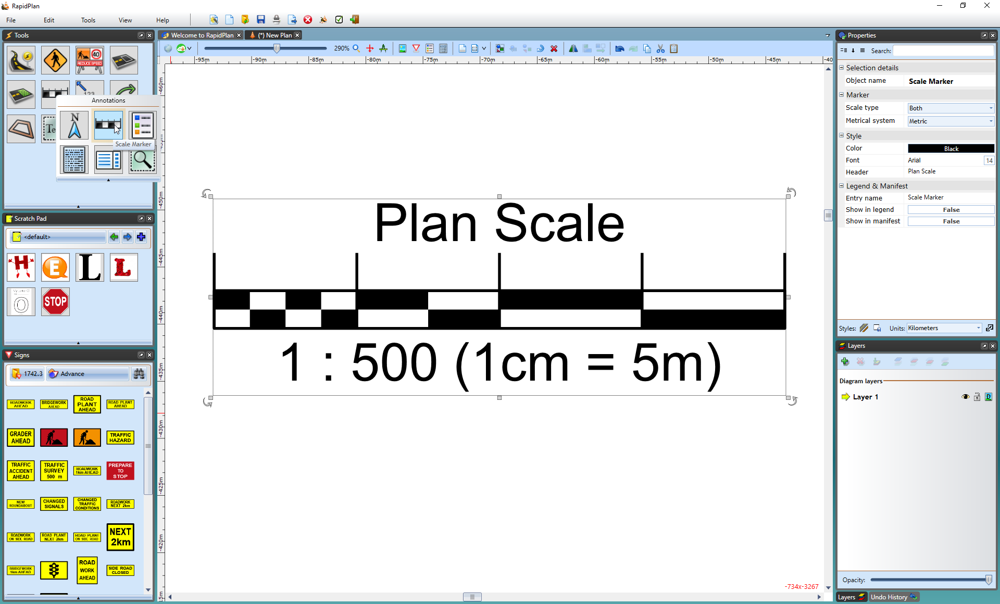

---

sidebar_position: 15

---
# The Scale Marker 

This tool is handy for advising viewers of the plan that there is a scale set. You are able to set the plan distance in **Imperial** and **Metric** system. 

## To place a Scale Marker

 - Select the Scale Marker from the Annotations tab in the Tools Palette.
 - Click once anywhere on your plan to place the marker.
 - Edit the values for the marker within the Properties Palette.

    