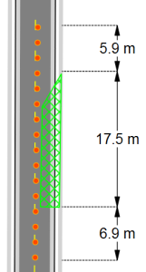
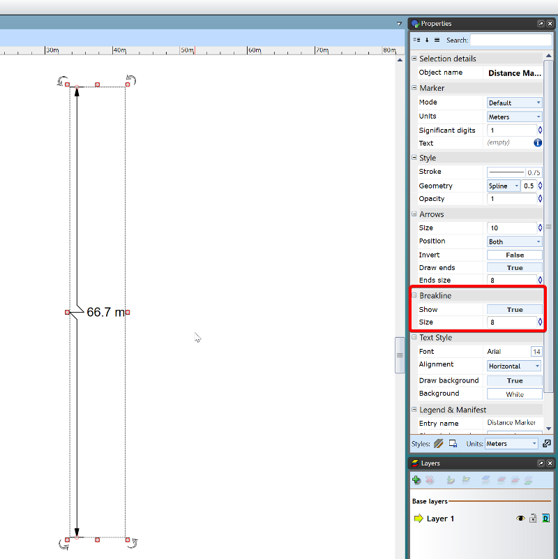

---

sidebar_position: 26

---
# The Six Distance Markers (part 2)

## The Angle Marker Tool 

This tool enables you to show angle degrees on your plan.

**To place an Angle Marker:**

 - Select the **Angle Marker** tool from the Marker tab in the Tools Palette.
 - Click the space you wish to measure (the first click will be the angle measured) 
 - Click a second time to mark the base point of the angle.
 - Drag your mouse in the direction you want to measure and click to finish the angle once it is set to the desired degree/location.

    

    **Note:** Like any item in RapidPlan, the angle marker, once made, can be moved and adjusted, with the degrees changing accordingly.

    ## The Area Marker Tool

This tool calculates the area you allocate which is shown as the cross-hatched netting in the image below.

**To place an Area Marker:**

 - Select the **Area Marker** tool from the Marker tab in the Tools Palette.
 - Left click once to start drawing.
 - Continue clicking to set corner points of the area.
 - Right click to finish.

 ## The Combined Offset Distance Marker Tool

This tool allows you to create a combined marker that is offset on your plan.

**To place an Combined Offset Distance Marker:**

 - Select the **Combined Offset Distance Marker** tool from the Marker tab in the Tools Palette.
 - Left click once to start drawing the distance marker, left click again to end the first distance marker and start the second. 
 - Repeat this until you have all of your distances for that marker.
 - To finish the last distance press right click.
 - Drag your mouse laterally away from the distance marker to set the offset. Click a third time to finish drawing the marker.
 - Right click to finish.

## The Distance marker breakline

When not drawing to scale, use the Breakline property of a Distance Marker to indicate whether the marker symbolically represents a larger on-site distance.

To enable the breakline, simply select the distance marker, in its Properties there is a subheading for Breakline. 

Simply change it from False to True and it will set the breakline in the middle of your marker. You can also adjust the size directly underneath.

