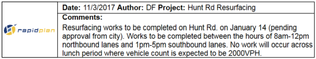
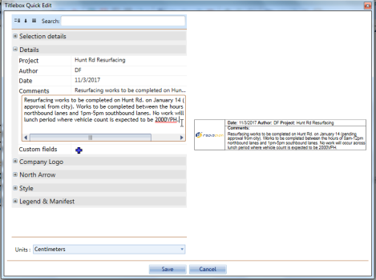

---

sidebar_position: 20

---
# The Title Box 

The Title Box is an essential item on your plan - it captures a lot of important information about you and your works in one convenient location.

**The Title Box has provisions for the following information:**

 - Date
 - Author
 - Project
 - Custom details
 - North marker
 - Company logo
 - Comments field

 ## Creating a Title Box

Creating a title box is a simple matter of selecting, filling and placing on the canvas. 

**To place a Title Box:**

 - Select the **Title Box** from the Annotations tab in the Properties Palette and place the box on the plan.
 - Double click on the Title Box to open **Quick Edit**.
 - Fill in each of the required fields and click **Save**.

 **Note**: As always in RapidPlan, this editing can be done from the Properites Palette.

## Manipulating the title box

The title box can be moved, rotated, resized, cut copied and pasted just like any other item on the canvas. Simply select it and make any changes as required.

