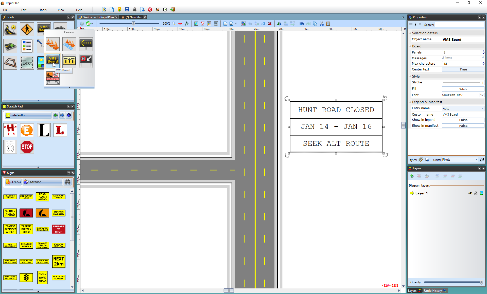
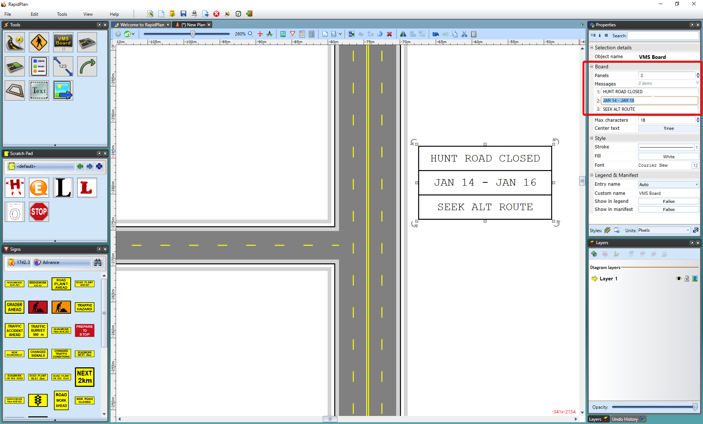

---

sidebar_position: 7

---
# The VMS Board

Like the Arrow Board, Variable Message System (or VMS) boards have many different names. We describe a VMS board as any electronic sign capable of cycling through multiple frames in order to display a textual message.

## The Layout of the VMS Board

In order to conserve space on the plan, the VMS Board is organized with one line for each frame as shown below.

On the roadway, the top line would occupy the first frame, the middle the second and so on. The VMS Board may take up  many different panels (although in many jurisdictions, VMS message sequences are mandated as being less than five panels).

## Creating a VMS Board

- Select the **VMS Board** from the Devices tab in the Tools Palette and place the panel in the desired location on the plan.
- Set the number of panels (or frames) using the **Panels** section of the Properties Palette.
- Enter the text for each frame in the Messages section of the Properties Palette.
- Deselect the VMS board to finish.

    

## Editing a VMS Board

To edit a placed board, simply double click on it and the form will reappear allowing you to make your changes.
