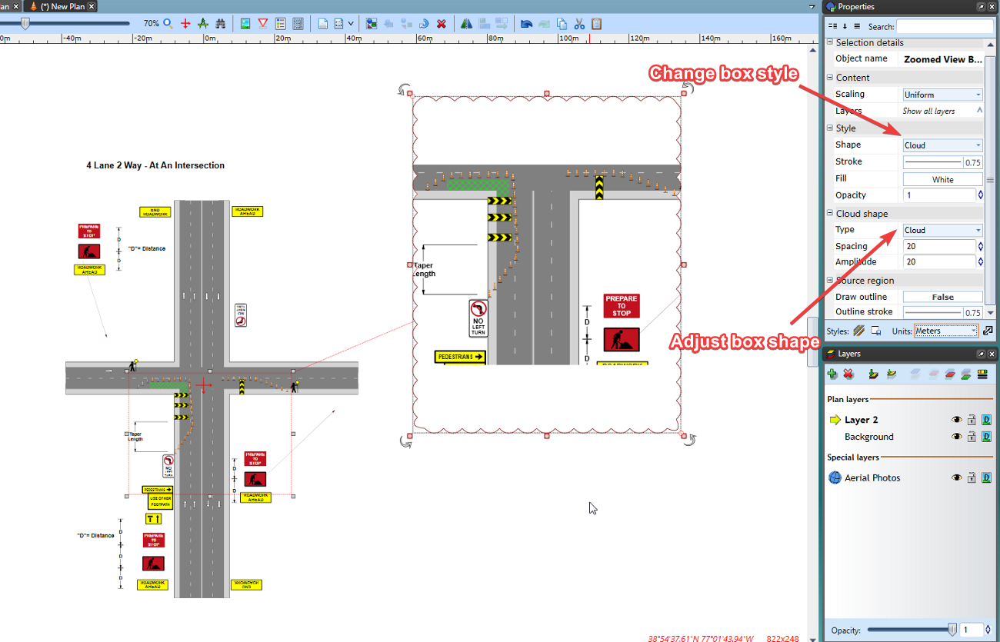

---

sidebar_position: 22

---
# Zoomed View Box Tool 

The Zoomed View Box tool allows you to create an inset that presents a detailed view of a specific section in a larger plan.

## Creating Zoomed View Box

1. Select the **Zoomed View Box** tool from the Annotations tab in the Tools Palette

2. Select the area you want to enlarge

3. Set the place where you want to put zoomed box

4. Set the size of box

    

## Changing Zoomed View Box Styles

The Zoomed View Box can be styled to present its content in an ellipse or cloud-shaped box.

Once the zoomed box has been created, select it and a number of options will be available in the Properties palette to suit your plan requirements.

