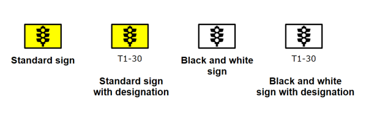

---

sidebar_position: 2

---
# What is a Sign Made of?

Before we launch into creating a sign, it's important to understand what the signs are actually made of. Every sign inside RapidPlan has been built up from basic items in the Tools palette (from the Shapes, Lines and Text tabs). Most sign faces are a **Rounded Rectangle**, the text is a **Text** object and irregular shapes are made out of filled **Polygons**, **Filled Beziers**, **Ellipses** and **Rectangles**. The items are then grouped and saved.

A couple of examples illustrate how the primitives are used:

If you aren't familiar with these base objects and how they work, see [The Basic Tools](/docs/rapid-plan/The%20Basic%20Tools/the%20basic%20tools.md). It will be considered assumed knowledge for this chapter.

**Every sign in RapidPlan has its own file on the computer and stored in each file is the sign, plus all of its variations.**

## Contents of the Sign *File*

The basic shapes and items make up the sign images, but now we need to understand how the signs are actually stored on your computer. Quite simply, every sign in RapidPlan has its own file on the computer and stored in each file is the sign, plus all of its variations.

### Sign Variations

So what are "variations" and why are they important?

Well as you are probably aware by now, RapidPlan has a Fax mode which converts your entire plan to pure black and white for to aid faxing. Of course, this black and white mode also includes the signs.

RapidPlan doesn't do this automatically, though. There is actually a separate sign (stored in the same file) that was created using black and white objects, that is linked to the base sign. When Fax mode is selected, RapidPlan replaces the colored sign on the canvas with the black and white variation from the same file.

Similarly, when the Sign designation mode is enabled, and the signs on the plan display their codes, it's because another variation of that sign, containing the code has been built and stored.

Put the variations together and you now have four signs to make one completely functional RapidPlan sign file.

**You don't have to Build all four Variations**
You might choose to only create the base sign and ignore the black and white and code designation variations. That's fine - it just means that if you select either of those two modes, your sign will just stay the same.

**Some Signs have more than four Variations**
Some of the RapidPlan signs have many more variations - usually because there are different configurations of signs in different sizes that we have included. An example is below. Note that for each of these color variations, there is a black and white equivalent.

