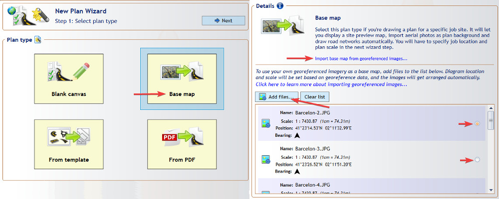

---

sidebar_position: 2

---
# Creating and Importing Georeferenced Images

## Importing Georeferenced images in RapidPlan

To import georeferenced images to a plan:

- Click Tools > Import > Georeferenced Image.
- Find and select the zip folder that houses the image.
- Click Open.

The image will be placed on your plan, matching the bearing, scale, latitude and longitude it was saved in.

Note a separate 'Georeferenced Images' layer will be created in the [Layers Palette](/docs/rapid-plan/using-layers/).
The image saved here will remain at the bottom of the layers order, just above imported aerial imagery, and can not be edited.

Note that the files you're adding must cover areas adjacent to the plan location.

You can also import georeferenced images to blank canvas plans. If such plans don't have a scale and location set, these values will be copied from the image you're importing.

## Importing via New Plan Wizard

In RapidPlan, go to **File** > **New Plan Wizard**. Select **Base map** as the plan type.

Click **Add files...** and select the images you want to import. Remember that you can only import images accompanied by georeferenced data, either in a World File format (for example for a .jpg image the corresponding world file will have a .jgw extension) or a MapInfo .TAB format. You can also select zip files that contain both the image and the georeferenced file (such as files exported from NearMap) - these will be extracted automatically.

The files you selected will appear on the scrollable list, displaying data extracted from the georeferenced file: location, scale and bearing. By checking the box on the right side of the list you can select which image is to be placed at the center of your plan. The selected image will also be used to preset the plan location, scale and bearing (other images will have their scale and rotation automatically adjusted to match).

Once you've selected the files, scroll up and click the **Next** button. In the second Wizard step you can confirm that your plan location and scale have been set correctly, then click **Create Plan**. The created plan will contain a dedicated **Georeferenced Images** layer with all the imported images automatically arranged to form a continuous base map.

### Editing imported georeferenced images

If you do want to edit or change the order of the georeferenced image:

- Click the Georeferenced Images layer in the Layers Paletted, making it your active layer.
- Right click on the imported image > Send to Layer.
- Either select an existing normal layer to send it to, or create a new one.
- It can now be edited, moved and re-ordered as you require.

## Creating Georeferenced images in RapidPlan

Any Print Region or image placed or imported on a RapidPlan plan that has a basemap can be exported as a georeferenced image.

To export a print region as a georeferenced image:

- Right click on the printer icon in the lower-left corner of the Print Region.
- Click Save > As Georeferenced Image.

To export an image as a georeferenced image:

- Position an image as you would like it in relation to the basemap (details on how to best do this below).
- Right click on an image > Save > As Georeferenced Image.
- Save your georeferenced image.

### Placement of an Image for Georeferencing

The most effective way to place your image is using the [Fit To](/docs/rapid-plan/integrated-mapping/the-fit-to-tool.md) tool, see this page for more information.
If you would rather manually resize, rotate and fit an image to background mapping, it is advisable to lower the opacity of the layer you are working in, using the slide bar on the [Layers Palette](/docs/rapid-plan/using-layers/). This pass-through vision allows easier matching of landmarks between the image and the background mapping.

Note that in order for georeferencing to be accurate, it is best to match the imported image to integrated mapping, or to mapping that has been correctly georeferenced itself.

## Exporting Georeferenced Images from NearMap

In order to create georeferenced images from NearMap, open the NearMap viewer, navigate to your desired location and select the area you want to export. Click the **Export** button at the top, select **Georeferenced image** format and make sure the projection is set to **WSG84 / Spherical Mercator**. Click **Download files** - this will download a zip file containing both the exported image and its georeferenced file.
The zip file can be imported to RapidPlan as described above (its contents will get extracted automatically). You can also export multiple adjacent areas into separate zip files, then import them into RapidPlan all together.

## Exporting from MapInfo Pro

In MapInfo Pro, navigate to the area you want to export and click **Output** > **Save Image**. In the options dialog, check the **Create a Geographically Referenced Tab File** box, then click **Save**. The image will be saved together with an accompanying .TAB file, allowing it to be imported to RapidPlan as described above. You can also export multiple adjacent areas into separate files, then import them into RapidPlan all together.

