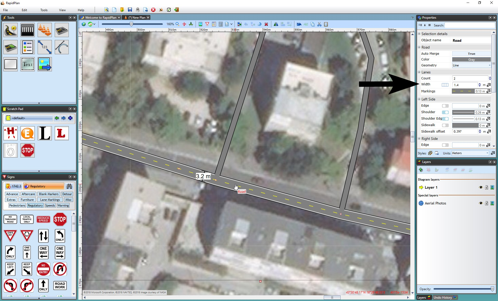
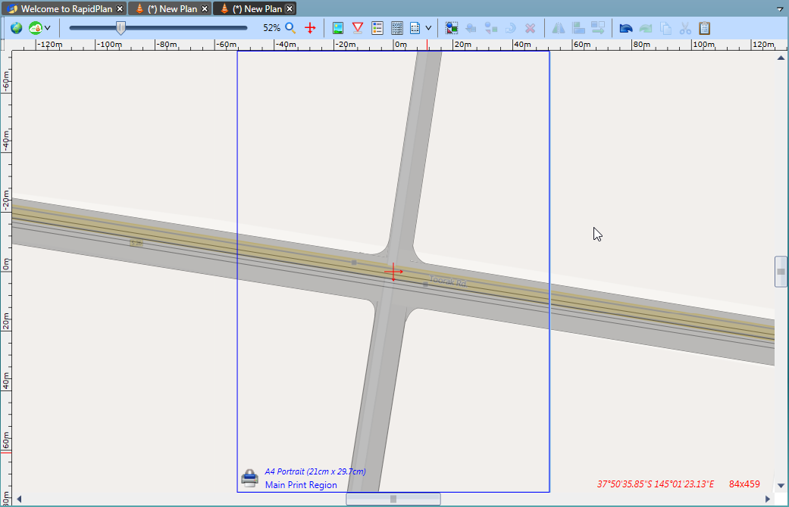
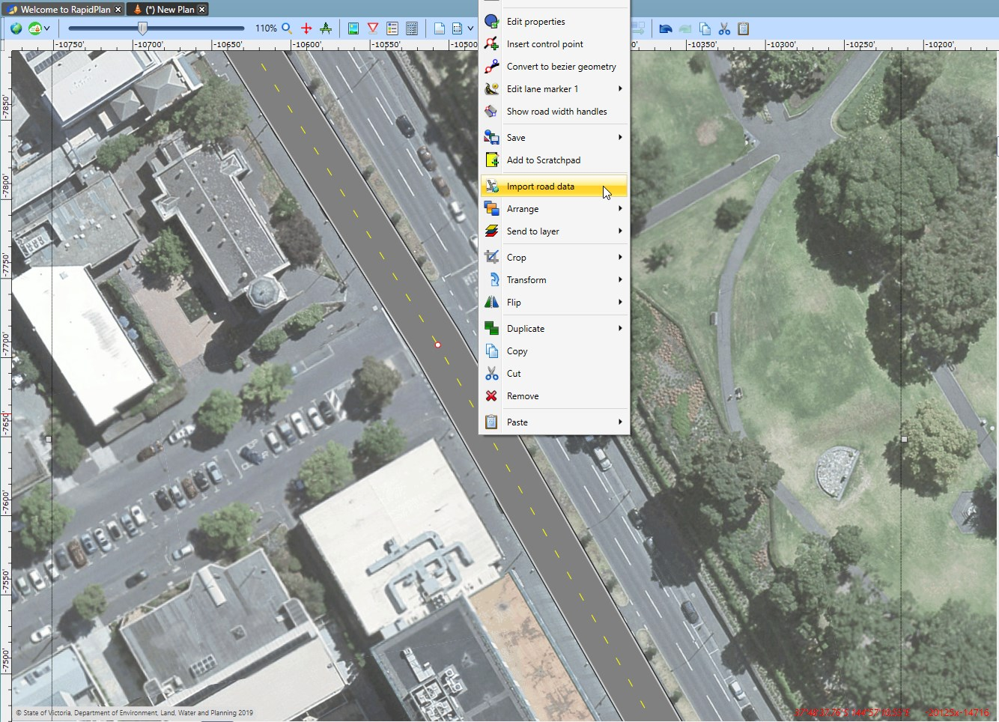

---

sidebar_position: 6

---
# Importing Roads

Importing roads onto integrated mapping creates a **road object** with properties that can be manipulated.

There are three ways of importing your roads;

 1. Import **all roads in Print Region** by right clicking on the print region printer icon and selecting **Import Roads**.
 2. Select a custom area via **Tools** > **Import** > **Road Layout** to import **all roads in the custom area**.
 3. Select **individual roads** by right clicking on the road and selecting **Import Roads**.

## Matching the Width of Imported Roads

As you have a set scale, you can accurately measure the width of the satellite road with a **distance marker** tool and adjust the road object properties accordingly.
To make this easier, lower the opacity of the layer your roads are on.

## Matching Road Markings

Once your road widths are adequate, you may need to make some manual adjustments, such as adding **Road Corners** and **Lane Markings**.

**To adjust the road objects to match the satellite image:**

 1. First, adjust the road layer **opacity** in the layers list to see the satellite image through the road object. This will make transferring lane markings much easier.

2.You may need to adjust the roads by adding **road corners** or **turning lanes**, etc. Make sure to copy the **style** of the road to each road tool by copying the style from the main road, selecting the new object and using **CTRL + SHIFT +V** to paste the style.

 *For more information of how to use Road tools, see [The Road Tool](/docs/rapid-plan/the-road-tool) and [Othr Road Tools](/docs/rapid-plan/other-road-tools/).*

 In the image below, the provider has been changed to the Omniscale, so you can see the road corners are the same style as the road.

 **Note:** The Road Corners were placed with the satellite provider to trace the exact shape.

3.When you are satisfied with your roads, add other necessary features such as lane markings.

 *For more information on how to use Lane Markers, see [Other Road Tools](/docs/rapid-plan/other-road-tools/).*

_Completed_Plan_No_Satellite_(Right).png)

4.Once your base road layout is drawn up, you can print it, use the fax mode icon to convert it or start adding your traffic management information.

## Importing road names and speed limits

After using the Roads Import tool, right-click on the imported roads and select "Import road data" as seen below.

After the road data is imported it will display as shown below. If the required data is available in OpenStreetMaps, your roads will get annotated with names and speed limit signs.

