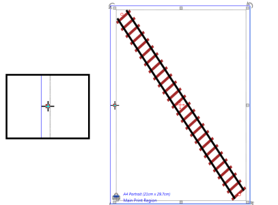
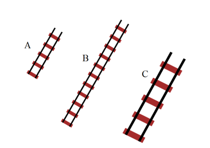

---

sidebar_position: 7

---
# Resizing Objects

There will almost always be two different ways of resizing an object in RapidPlan. It is important to understand the difference between the two methods, and when to use each.

## Resizing using Control Points

Most of the RapidPlan objects can be resized by moving their control points. Moving the control points changes the shape of the object, rather than just stretching or shrinking it.

**To resize with control points:**

- Select the item you wish to resize.
- Drag its control points until the object is the size and shape you
   require.

    

    **Note**: The cursor has changed as it hovers over the control point. This means it is ready to move the control point.

## Resizing with the Resize Handles

You can also change the size of your object with the resize handles. Unlike the control points which change the shape of the object, the resizing handles stretch and shrink your selection.

**To resize with the resize handles:**

- Select the item you wish to resize.
- Drag either of the resize handles to stretch or shrink the object. (If you hold **SHIFT** while you resize, the length to width ratio of your object will be maintained).

    

    **Note**: The cursor has changed as it hovers over the resize handle. This means it is ready to move the handle.

## Resizing with the Skew handles

Create pseudo perspective views by holding Ctrl+Alt to turn object scale handles into skew handles.

When you have your sign/object selected, simply hold the Ctrl+Alt keys to activate the skew handles. You can then adjust the skew of the object with these keys held down, as you can see in Figure 5.15 below.

## Comparing the Two Methods

It is critically important to understand the distinction between resizing using control points and resize handles so we have compared the two methods below.

Below is three sections of rail line. Section A is the original piece (5 sleepers). Section B has had its control points moved, lengthening it and adding sleepers (11 sleepers). Section C is the original piece, resized using the resize handles. Notice that C still has the same number of sleepers (5) but is much larger. The resize handles have effectively rescaled the section of track.

