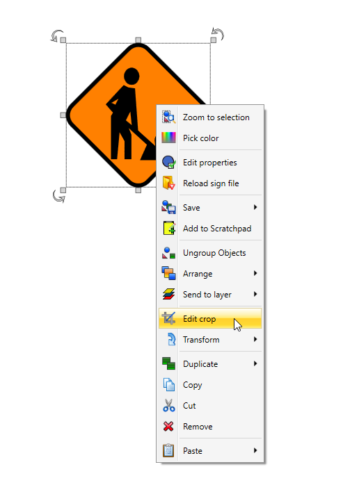
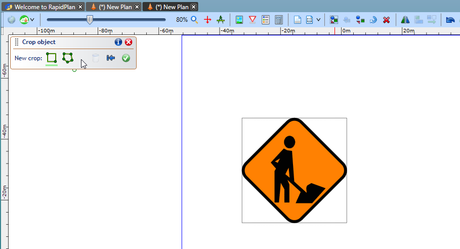
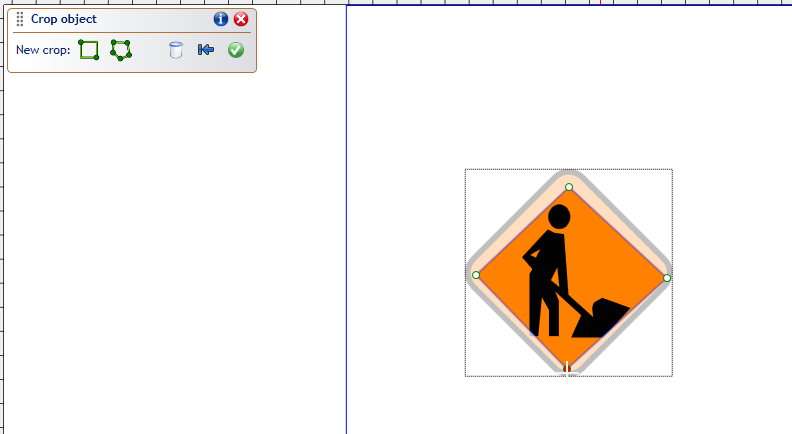
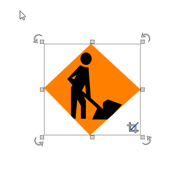

---

sidebar_position: 12

---
# Cropping Objects

Crop images and other objects to any desired shape, edit individual points and segments in existing crop geometries.

To begin cropping an object, simply right click on the object you wish to crop, then left select "Edit crop".

This will then display a dialog box that allows you to change your crop mode. You can select between: **Rectangular region**, which allows you to select and crop a rectangular region; or **Polygon region**, which allows you to add multiple control points to create the crop shape.

Once the desired crop region has been added, click the green tick button in the dialog box to apply the cropping.

**Note:** The crop object size/shape can be adjusted at any time by moving it's green control points.

To edit the cropped region, simply select the object, right click, select 'Edit crop' and the dialog box will re-open.  You can now adjust the crop region or revert back to the original image.

