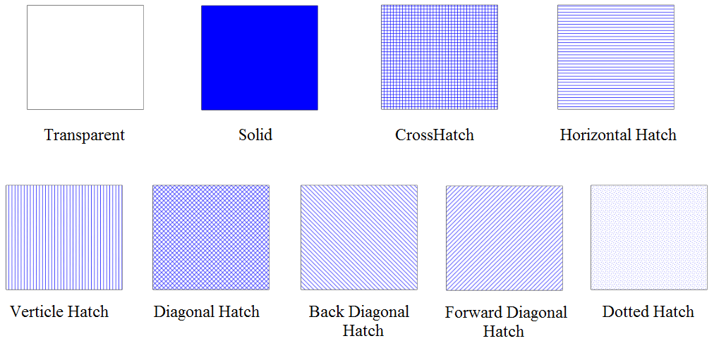
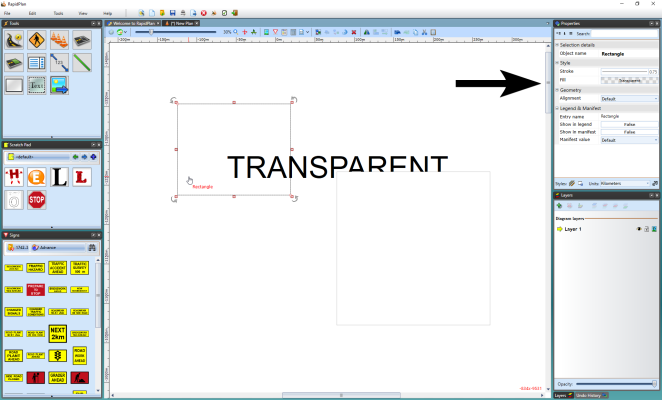
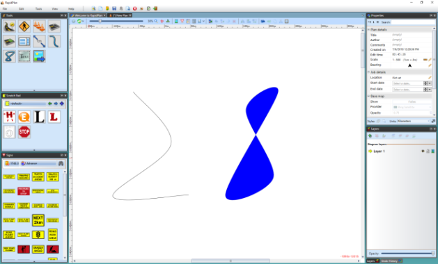
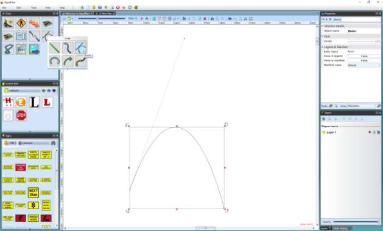

---

sidebar_position: 2

---
# Using Line and Shape Tools

The technique for drawing with these tools varies from object to object. Many of the objects such as Rectangles, Ellipses, and Rounded Rectangles are simple two-control point structures. Polylines, Polygons, Splines, Arcs, and Beziers can have as many points as you like. Irrespective, the process is simple.

## To Draw any Line or Shape

- Select the tool from the corresponding tab in the Tools Palette.
- Click to place the first control point.
- Continue clicking until the necessary number of points are placed and the object is complete.
- Right click to stop drawing.
- Right click again to drop the tool.

## Auto Aligning Lines and Shapes

To ease the creation of these items, there is a very useful auto align feature which allows you to keep the dimensions of your lines and shapes square.

In most cases, holding **SHIFT** while you draw will cause the control points you are placing to align themselves to a 90º or 45º increment. This means that you can keep your verticals and horizontals perfectly straight.

Rectangles, Rounded Rectangles and Ellipses form special cases - holding **SHIFT** still keeps their second control point at 90º or 45º but this of course has the effect of holding the rectangles to perfect squares and the ellipse to a perfect circle.

## Properties of these Basic Tools

As is the case with all objects in RapidPlan, you can view and change the properties of a basic tool by double clicking on it to open the **Quick Edit** screen or from within the Properties Palette.

The properties for the **Lines** are very similar. This is also the case with the **Shapes**. Regardless of type, all the basic tools have the option to be rotated or flipped vertically and horizontally by using **CTRL + R** to rotate and the flip toolbar to flip the objects.

### The Lines Properties

The properties of the **Lines** are defined by setting the style of stroke used:

|Properties      |                                                                      |
|----------------|----------------------------------------------------------------------|
|**Stroke width**|The weight of the line (default is 0.75).                             |
|**Stroke color**|The color of the line.                                                |
|**Stroke style**|A variety of dashed, solid and dotted line styles are available.      |
|**Stroke caps** |Choose from four line end styles: flat, square, round, and triangle.  |

### The Shapes Properties

A shape is defined by its outline and an internal area - each handled separately. Similar to lines, the **shape's** outline style is set by altering the stroke settings. The properties for the internal area are set by modifying the fill used for the shape.

You have three controls for the fill: **Color, Opacity and Style.**

**The "Transparent" Color**
One of the color settings for lines, shapes and text is **transparent**. In the case of lines including shape outlines this effectively just means **none**. For the fill of shapes however, a transparent setting allows you to see what's underneath. Don't confuse **transparent** with **white**. As the diagram below shows, they are very different.

## The Spline-Based Tools

The **Spline** and **Filled Spline** have an extra property. They are different because they are built around what is known as a spline curve. Spline curves are formed by placing points along a desired path - RapidPlan uses a predefined curve radius and creates the curved line. (The road tool also is a spline curve).

## The Bezier Tools

One of the trickier techniques to master in RapidPlan is the drawing of a Bezier. Beziers offer a powerful way to create curves with great precision.

There are two components of a Bezier curve:

- The center **Control Point** sets the apex of the curve.
- The **Curve Handle** allow you to set the direction and sweep of the curve.

    

For full details on how to use the bezier tool, see [this page](./the-bezier-tools.md)

## The Arc Tools

There are three arc-based tools in RapidPlan, the **Arc** tool, the **Pie Arc** tool and the **Road Arc** tool. All of these tools are created from a radius, making perfect curves.

**To use an arc tool:**

- Select the necessary arc tool from the Tools palette.
- Click once to set the radius of the arc.
- The second click is where you draw your arc by moving the cursor in the direction of the arc.
- Click to complete the object.
- Right click to drop the tool.

You can also specify numeric values for the radius, start angle and end angle for the arc.

