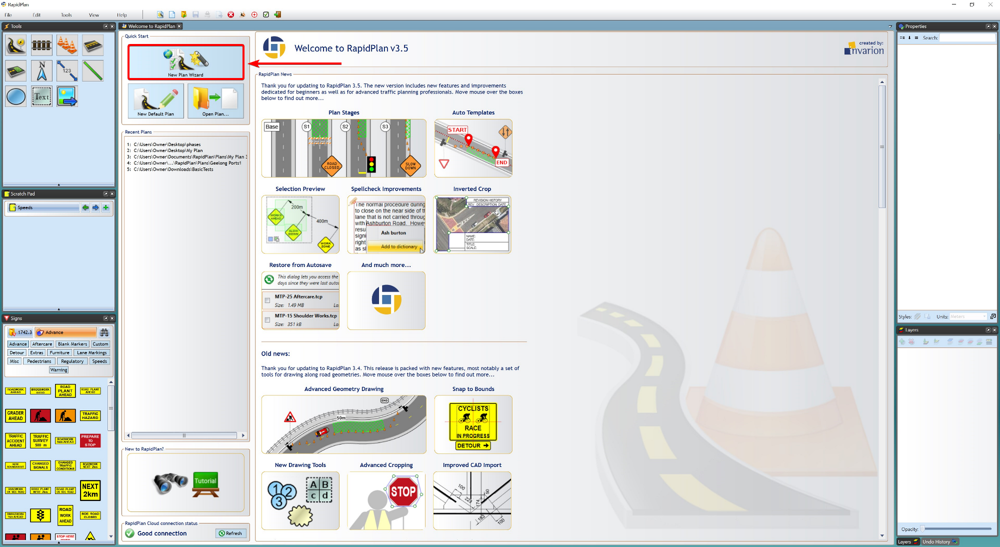
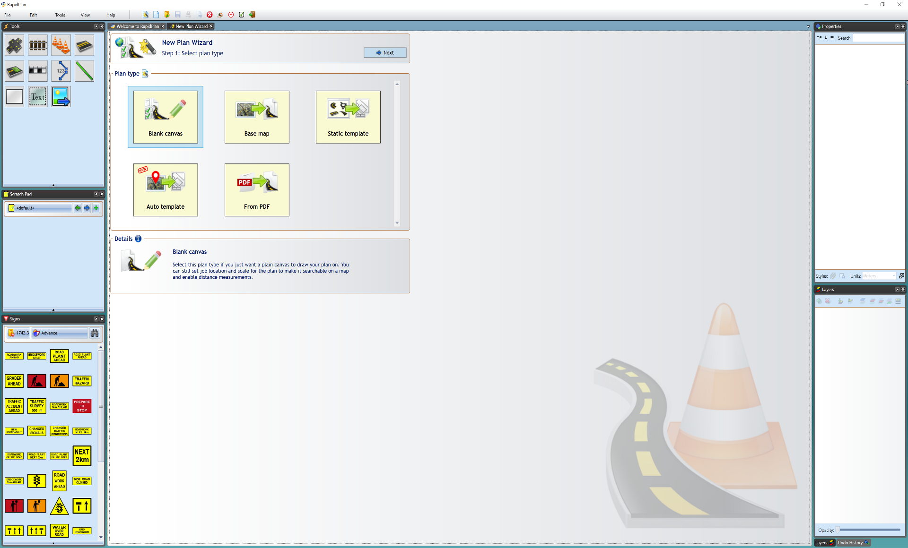
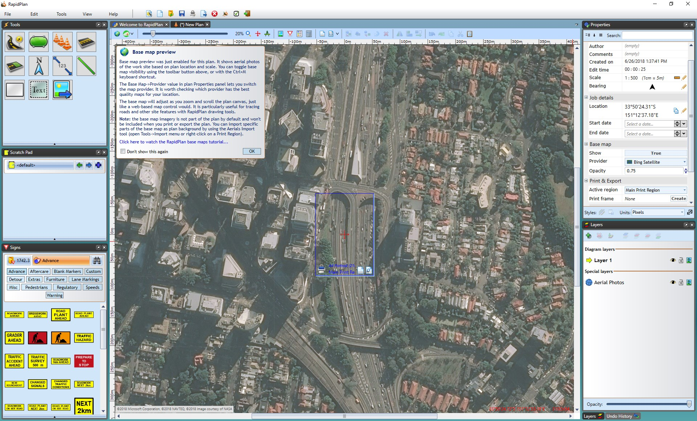
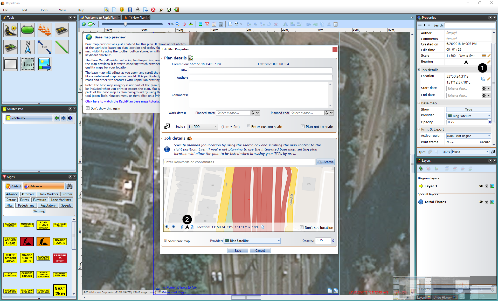
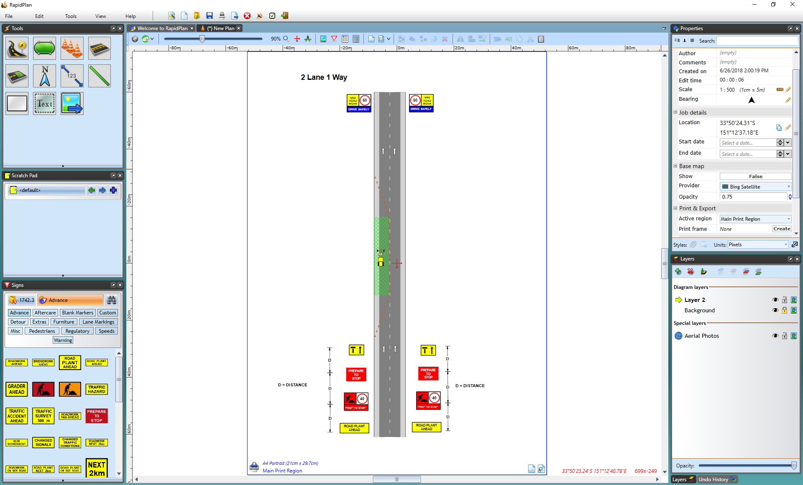

---

sidebar_position: 1

---
# The New Plan Wizard

The first step in RapidPlan is choosing a canvas to work on. The New Plan Wizard allows you to select a type of plan and specify details of your plan (such as scale, print region, etc.) before you begin (which a **New Default Plan** does not).

The New Plan Wizard can be accessed from the **Quick Start** section of the Welcome to RapidPlan tab. If this tab is closed, the wizard can also be accessed by going to **File > New Plan Wizard**.

Once you have selected the **New Plan Wizard** option, you will have four plan types to choose from in **step 1**:

- Blank Canvas
- Base Map
- Static Templates
- Auto Template
- From PDF

After you select your plan type, **step 2** allows you to enter plan details, such as a title, author, comments and relevant job dates. You can also choose a print region, set a scale and enter your job location site.

If you choose not to enter any details here, a default print region and scale will be set and any details can be changed at any time from the Properties Palette.

## Blank Canvas

Selecting the **blank canvas** option will provide you with a plain canvas to draw your plan on.

**To create a Blank Canvas Plan:**

- Select **New Plan Wizard** in the Quick Start section of the Welcome to RapidPlan page.
- In **step 1**, select **Blank Canvas**.
- In **step 2** enter your plan's details and choose a print region and scale if needed.
- In this step, if you scroll down you can also add a **job location** to make the plan searchable by location.
- Once you are ready, select **Create Plan** in the top right of the window.

    

    **Note**: Selecting a job location with this plan type only makes it searchable by location, if you want to use the integrated mapping feature, see **Base Map** below.

## Base Map

Select this plan type if you're drawing a plan for a specific job site. It will let you display a site preview map, import aerial photos as the plan's background and draw road networks automatically.

**Creating a New Plan from a Base Map:**

- Select **New Plan Wizard** in the Quick Start section of the Welcome to RapidPlan page.
- In **step 1**, select **Base Map**.
- In **step 2** enter your plan details and choose a print region and scale, or leave them as default.
- Scroll down to **Job Location** and type in the address for your job in the search bar and click **Search**.
- Select **Create Plan** and your plan will load on your canvas as shown in the image below.

    **Note**: in the Properties Palette you can change the provider of the map from omniscale, satellite and hybrid.

    

    

## Base Map Bearing

The bearing of a base map is adjustable, enabling you to draw plans at any orientation. To adjust the base map bearing:

1. Create a new plan in new plan wizard
2. Select the Base map plan type
3. When choosing job location, adjust bearing to liking as shown below.

The base map bearing can also be adjusted in the properties tab on the right hand side once map has already been inserted into the plan as seen in the image below.

**Note:** To fine tune the bearing adjustment hold down the **CTRL** key and click and drag the mouse around on the map to get the desired position.

**Note:** Changing the bearing of the map after initiating your plan will readjust the positions of print regions, to ensure that they are accurately centered on the intended location.

## From PDF

This creates a new plan from an external PDF document used as a background for your plan. To use this option, select **From PDF** at **step 1** as pictured below, and an **Open** window will appear for you to select the PDF from your computer. Select the PDF and click **Import**. You will see the PDF previewed in the window. If everything is correct, click **Next**.

You will now be at the **step 2** window where you can enter your plan details. You can keep the default settings or enter your own details. Once these are entered, select **Create Plan** and the PDF will appear on your canvas area.

## Static Template

This creates a new plan base on a TCP template selected from a library of typical jobs. Objects imported from the template are editable so you can adjust the drawing for the specific job you're planning. You can also create your own templates to access here and work from.

## Creating a New Plan from Template

- Select **New Plan Wizard** in the Quick Start section of the Welcome to RapidPlan page.
- In **step 1**, select **Static Template**.
- A **New Plan From Template** window will appear as shown in the image below, where you can select your regional template package and your template.
- Once you have chosen your template, click **Select Template**.
- You will be taken back to **step 1**, now select **Next** at the top right of the window.
- You will now be at the **step 2** window where you may see your template's details already there. You can keep these and the default settings or enter your own details.
- Select **Create Plan** and your template will appear on your canvas  as shown in the image below.

    

    

## Auto Template

The purpose of the Auto template tool is to semi-automate the process of creating a traffic plan.

Auto templates are capable of laying out basic signage and work site devices at a selected works location.
This also includes parameters such as sign spacing and sign placing. These parameters are calculated based on road properties such as the road category and the marked speed.

For details on how to use the Auto Template see [this page](./Auto%20Template.md).
