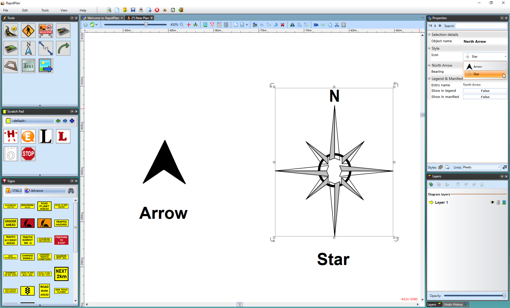

---

sidebar_position: 8

---
# The North Arrow

A North pointer Arrow or Star can be placed on your plan and rotated accordingly to allow viewers to see which way is North.

## Creating a North or Star Arrow

- Select the **North Arrow** tool from the Annotations tab in the Tools Palette.
- Select it to see it in the Properties Palette.
- Change the Style from Arrow to Star or vice versa from the **Style** tab and the **Icon** drop down menu.

    
