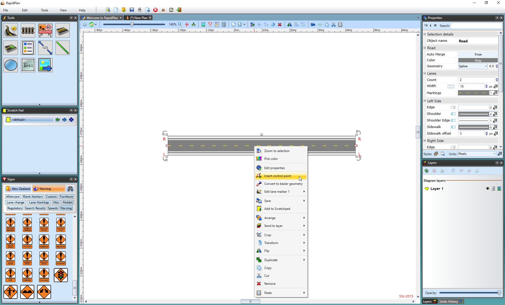

---

sidebar_position: 2

---
# Editing the Shape of an Existing Road

Like any other object in RapidPlan, the shape of the road once drawn can very easily be edited by shifting it's control points.

**To edit the roads shape:**

- Select the road by clicking on it once. This will make its control
   points visible.
- Drag any of the control points until the road is the correct shape.
- Remember that you can hold **SHIFT** to make the control points line up in a row.

In the image below, Road A is the original road. Road B has had the 2nd and 3rd control points adjusted to change the shape of the road.

## Adding and removing Control Points

There will almost certainly be circumstances where you need to add or remove a control point from a road to fine tune its shape.

Adding control points allows you to create extra turn points to your road, hence extra curves.

**To add a control point:**

- Select the road by clicking on it once.
- Right click where you want to add the control point, and select **Insert Control Point** from the context menu.

    

Removing control points is equally simple as adding them. You do need to remember that you can only delete end control points if there is at least one control point in between. That is to say, that there must be at least two control points on every road.

**To remove a control point:**

- Select the road by clicking on it.
- Right click on the desired control point and select **Remove Control Point** from the context menu.

    
