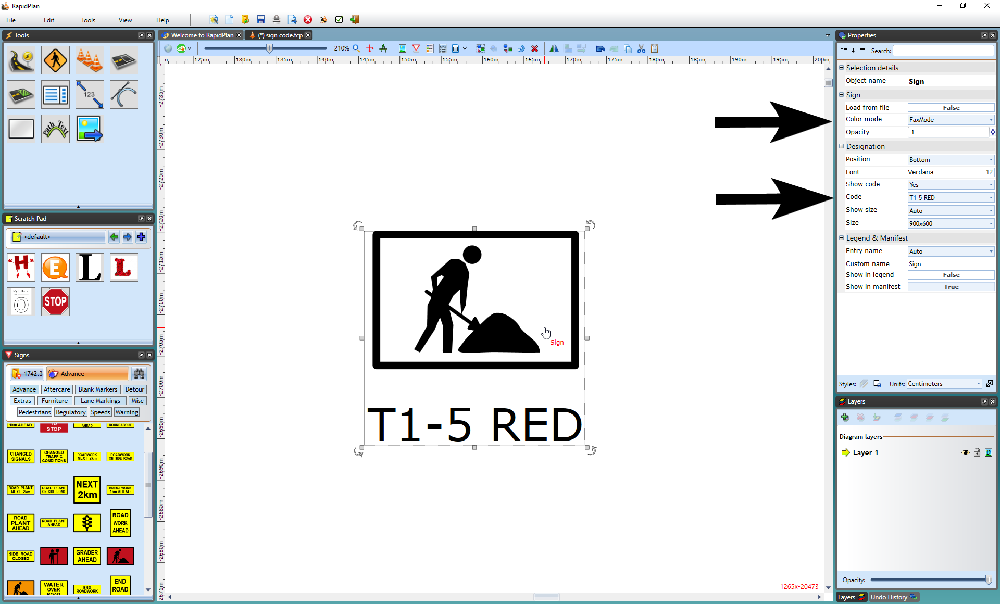

---

sidebar_position: 4

---
# Choosing the Displayed Variation of a Sign

Because there are often multiple versions of the same sign, you need to tell RapidPlan which version you want to use on your plan if the default variation is not suitable (by default, the standard sign with no code will be displayed). Changing the variation is easy.

**To set a different variation of a selected sign:**

- Select the sign and go to the Properties Palette.

- Make changes to sign variations as necessary. I will change the sign to allow Fax Mode (no color) and to show it's sign code as follows.

**Note**: To change the variations to all your signs within the plan, simply use the Toolbar and click on Toggle Color/Fax mode or Sign Designation as explained [Special Canvas Modes](/docs/rapid-plan/the-canvas/special-canvas-modes-fax-mode-and-sign-designation-mode.md) of this User Manual. This option will save you lots of time if all the signs are to be changed
