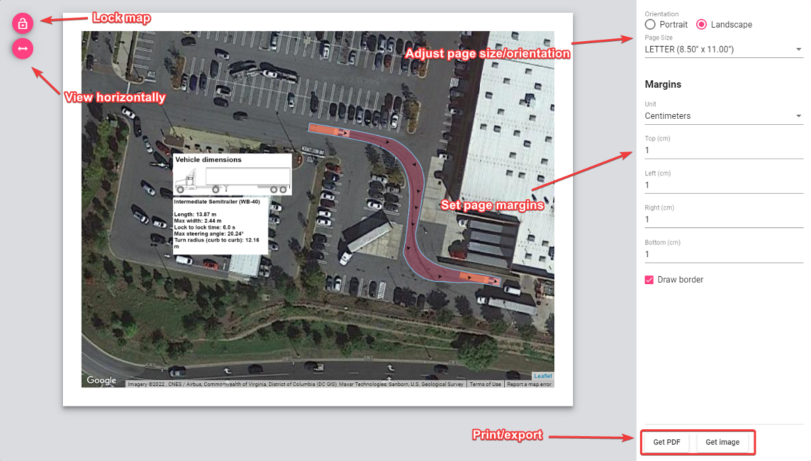
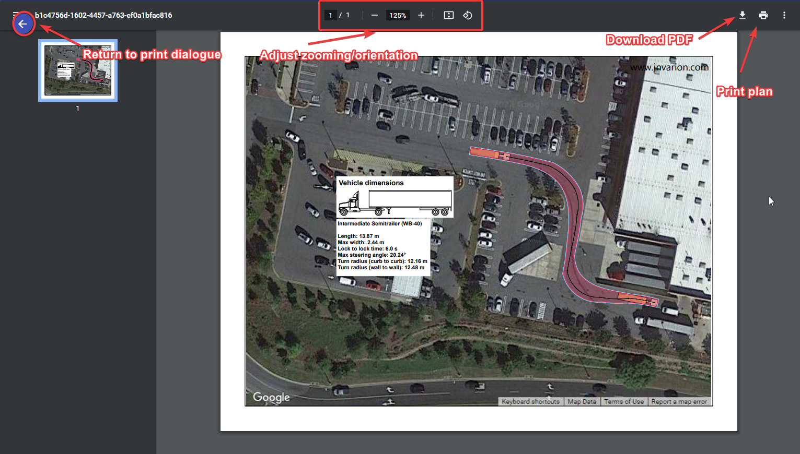

---

sidebar_position: 7

---
# Printing and Exporting

Completed plans can be printed directly from the application, or exported as a PDF and Image file.

<iframe width="560" height="315" src="https://www.youtube.com/embed/tZzqOvNgMI8?si=PG9qo-HqHHTM3vbb" title="YouTube video player" frameborder="0" allow="accelerometer; autoplay; clipboard-write; encrypted-media; gyroscope; picture-in-picture; web-share" referrerpolicy="strict-origin-when-cross-origin" allowfullscreen></iframe>

## Printing dialogue

When your plan is ready for Printing or Exporting, simply select the **Print** option in the Main Menu, or click the printer icon () in the toolbar. Once selected, the following print dialogue window opens, containing several options to customize your document.

These options include:

- **Live preview:** The preview of your plan in the center shows how your plan will print out. In this preview window you can adjust the plan to fit the page size, by simply clicking and moving the map around, or by simply scrolling up and down to zoom in and out on the map area.
- **Lock map:** The lock plan preview button locks the ability to adjust the plan preview.
- **View horizontally:** The view horizontally button adjusts the view of the plan for different screen sizes. For example, a laptop screen is quite often smaller - this button adjusts the view so that you can view the plan appropriately on your screen.
- **Page size and orientation:** Change the page size and orientation to suit your printout. When selected you will also need to make sure, if you have added a template, that it matches the page size/orientation you have chosen.
- **Page margins:** Adjust the page margins.
- **Print or export:** When ready to print, simply select the **Get PDF** button to download your plan as a .PDF file, or select **Get Image** to download the plan as a .PNG file.

## Printing and exporting plans

Once the **Get PDF** button has been selected, you will be able to Print or Download your plan to PDF.

As shown in the image above, clicking the Download PDF button will allow you to save your plan as a PDF file. This will then open your default PDF application and show you a preview of your downloaded plan. Clicking Print plan will open your default printer dialogue.
