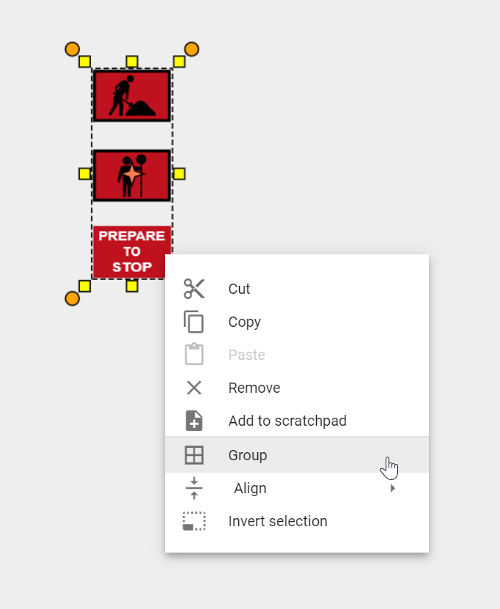

---

sidebar_position: 4

---
# Grouping and Un-grouping Objects

Grouping and un-grouping objects is an important technique to learn. The benefit of grouping objects is the ability to adjust several objects together, rather than individually.

- Group by holding down the **Shift** key and **Left clicking** each object you wish to group. Once they are all selected, **Right click** and select **Group** - as shown in the image below.

- Alternatively, use a selection window (see [select tool](./selecting-objects-and-tools.md)) to select the desired objects, then **Right click**.

Once grouped you can adjust the group of objects as one. You can also add the grouped objects to your Scratchpad for later use.

To **Un-group** the objects, simply **Right click** on the objects and select **Un-group**.
