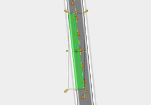

---

sidebar_position: 1

---
# Selecting and Altering Objects

## Selecting

Selecting objects allows you to see and make changes to that object/s' [Properties](/docs/rapidpath-online/rapidpath-online-workspace/properties-palette.md), its [Context Menu](/docs/rapidpath-online/rapidpath-online-basics/context-menu.md), as well as being basis by which to move and transform that object.

The direction you drag the mouse creates a different colored window.

### Methods of selection

**Single objects** can be selected by simply clicking on them.

**Multiple objects** can be selected by holding **shift** while clicking each object required. Clicking an already selected item while holding **shift** will have the effect of removing that item from selection.

**Multiple objects** can also be selected by clicking and dragging your mouse across an area of the Canvas, creating a **Selection Box**.

### Selection Boxes

As described above, **selection boxes** are created by clicking and dragging your mouse across an area of the Canvas.

There are two types of **selection box**, which you use will depend on the direction you click and drag:

- **If you drag to the *right***: The window is **purple**. This will only select objects that are *completely within* the selection box.
- **If you drag to the *left***: The window is **green**. This will select all objects that are *touching* the selection box.

|  | Drag right (Purple)   |  | Object selection     |
| ------------------------------------ | --------------------- | ------------------------------------ | -------------------- |
|   | **Drag left (green)** |   | **Object selection** |

## Altering Objects

| Selected object                                         | Features                                                     |
| ------------------------------------------------------- | ------------------------------------------------------------ |
|                 | **Bounding Box:** When an object is selected, it is surrounded by the bounding box. |
|                 | **Resize Handles:** The resize handles allow you to stretch or shrink the selected object. When selected, every object will have eight resize handles; three at the top, three at the bottom, and two on the lateral sides of the bounding box. |
|                 | **Rotation Handles:** Click and drag a rotation handle rotate an item. This example has four rotation handles - an arrow in each corner of the bounding box. |
|  | **Control Points:** [Control points](./control-points.md) are special handles which allow you to alter the shape of an object. Many objects and road tools have control points and allow for the insertion of multiple control points anywhere along an item. |

**Note:** Hold **shift** to preserve a selected object's proportions when **resizing**.
