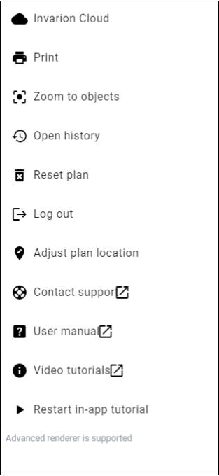

---

sidebar_position: 3

---
# Main Menu

The Main menu contains a number of options to assist plan creation. The image below shows the main tools of the RapidPath Online menu.

The table below describes the function of each option in the Main menu.

| **Menu Selections** | **Description**                                              |
| :------------------ | :----------------------------------------------------------- |
| Invarion Cloud     | Navigates to Invarion Cloud.                                |
| Print               | This option opens the Print dialogue box. Refer to the [printing](/rapidpath-online/printing-and-exporting/) for more on printing and exporting plans. |
| Zoom to Objects         | Selecting this option will return your view to where the objects are situated on your plan. This feature is especially helpful if you lose your bearings on the unrestricted canvas and wish to return to the plan's point of origin. |
| Open History       | RapidPath Online contains an auto-save feature. Selecting Open History opens a dialog which allows you to click through time stamped auto-saved versions of your plan. You are able to either restore a version of a plan, making it the active and most recent version, or make a copy of the plan, creating a new plan file in the Invarion Cloud. |
| Reset plan  | This option erases all objects, signs, layers, plan location and history within a plan. Plans accidentally reset can be restored by selecting Restore plan. |
| Log Out   | Selecting Log Out will end your session and log you out. |
| Adjust Plan Location     | You can now adjust the location of your plan by panning the canvas area or searching for a new location. You can also adjust the plan scale, if required. Once you have repositioned your plan, select 'Stop adjusting location' in the main menu or start drawing any object. |
| Contact Support   |Selecting this opens a webpage with the contact details of our Tech Support team. Tech Support is available 24 hours, 5 days a week to assist.|
| User Manual  | Links directly to this RapidPath Online User Manual. |
| Video Tutorials  | Links to our instructional YouTube page.  |
| Restart In-App Tutorial  | Click to restart the guided tour of RapidPath Online and its features. |
