---

sidebar_position: 1

---
# Preparing Swept Path Analysis'

## Adding Vehicle to the Plan

The first step in creating the Swept Path Analysis is adding a vehicle to your plan. To do this, navigate to the Vehicle Library. In the Vehicle Library palette, choose the library and vehicle you are interested in and left-click. Now, place the vehicle onto your plan with the left mouse button.

Vehicles in RapidPath Online can be positioned and rotated just like any other object. But, their size is automatically adjusted to the plan's scale and cannot be changed.

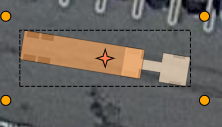

When clicking on a vehicle you can check its most important parameters inside the Properties palette.

## Drawing a Vehicle Path

To start drawing a Vehicle path, select the vehicle on your plan and click on ''Continue drawing'' in the context menu.

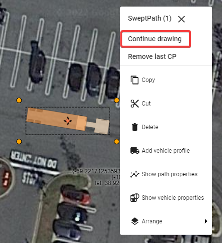

When in "Continue drawing" mode a special window called "Section details" will appear with settings for:

- **Speed** - Vehicle speed.
- **Friction** - Lateral friction factor dependent on the vehicle speed and calculated according to the chosen standard. To set a custom value disable speed and friction dependency by clicking on the ''derive friction from speed'' toggle button on the left and enter the desired value in the field.
- **Turn on Stop** - Turning this option on ("True") allows the vehicle to make a stop and turn the front wheels between different sections(at control points) of the Vehicle path.

and info such as:

- **Min radius** - Minimum turning radius (centerline) of the vehicle at the given speed and friction.
- **Max angle** - Maximum turn angle of the vehicle at the given speed and friction.
- **Max speed** - Maximum speed for the vehicle taking into account standard guidelines, given speed, friction and current turn radius.

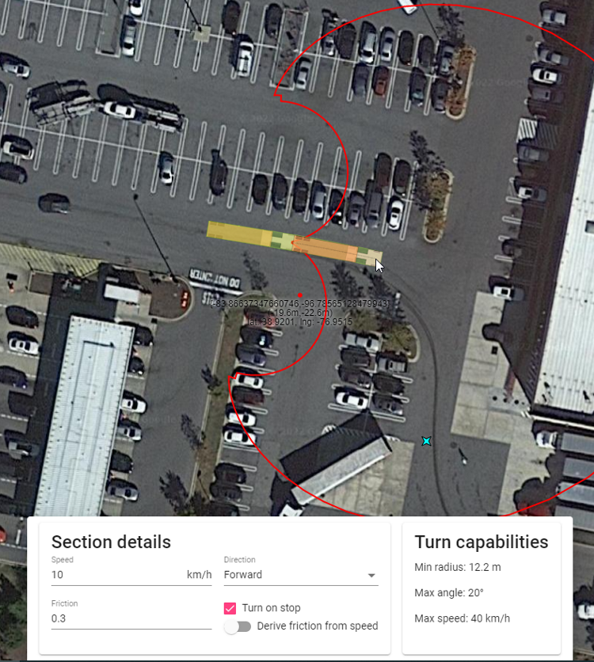

After setting the speed, friction and "Turn on stop" option you can start drawing the path. To do this, indicate the points on the canvas area by clicking the left mouse button. Each point creates another section of the Vehicle path. Each section can have different parameters such as speed, friction and turn on stop setting. You can adjust section parameters before making each point to create a path that consists of sections with different speeds, friction and other parameters.

You can only create a path within the maneuverability capabilities of the current vehicle at given parameters such as speed, friction, lock to lock time, etc. Observing a real-time preview of the vehicle, the turning angle indicator during drawing will help you make the desired path. The turn angle indicator will show you your max turning radius.

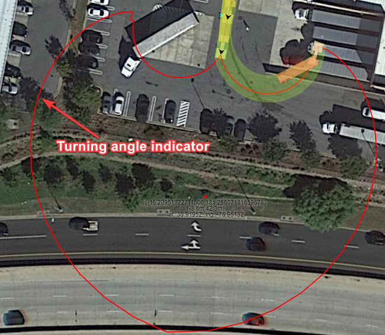

Finish drawing the path by clicking the right mouse button. Once the Vehicle Path is finished it turns into a single object that can be freely moved and rotated.

## Clearance Envelope

Clearance Envelope will allow you to add offset to the Sweep Envelope to accommodate for driver error or real world situations. To turn on the Clearance Envelope go to the "Clearance" section in path's properties and change "Show" property to "Filled" or "Outline".

You can edit the clearance envelope offset distances in the "Clearance dimension" section of the path's properties.

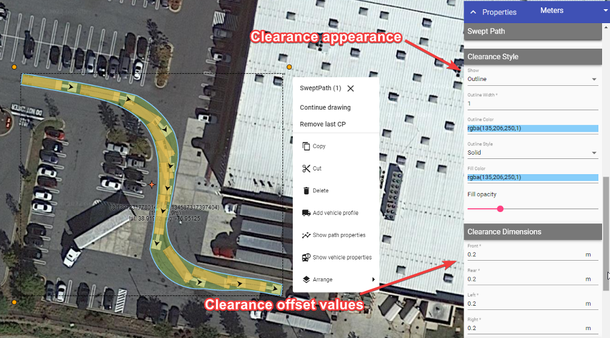

## Styling Vehicle Path, Sweep Envelope and Wheel Paths

Vehicle Path, Sweep Envelope and Wheel Paths can be styled in many different ways using Vehicle Path's properties in the Object Properties window. Aside from visual customization, you can also:

- Add wheel paths separately for front and rear wheels;
- Show/hide directional arrows that indicate the start of each path section; and
- Show/hide vehicles along the path.

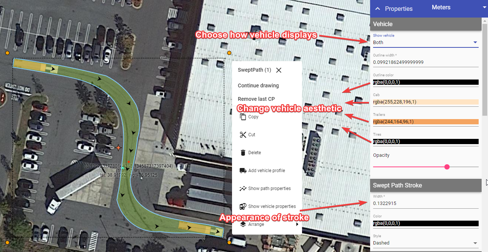

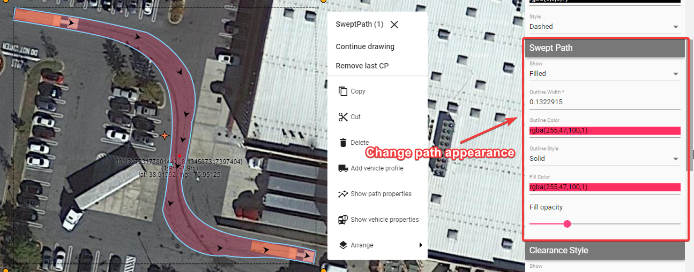

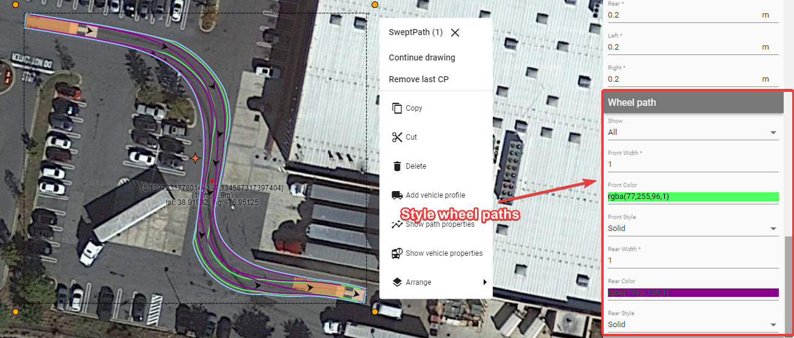

## Adding Vehicle Profile to the Plan

It is always a good idea to add the description of the vehicle used for the Swept Path Analysis to your document. You can easily do this by clicking the left mouse button on the vehicle or Vehicle Path and choosing "Add vehicle profile" from the context menu.

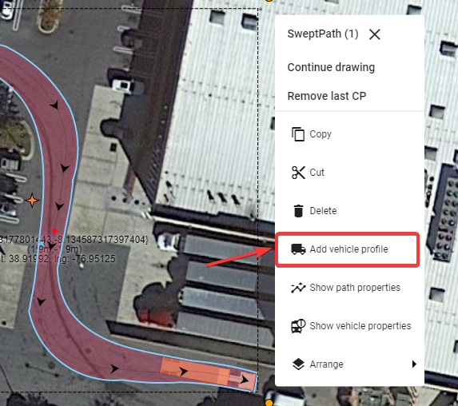

The Vehicle Profile displays the:

- Vehicle's name;
- Vehicle's side view with the most important dimensions; and
- Vehicle's properties crucial for the Swept Path Analysis.

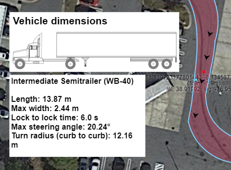

## Additional features

The final 2 features of the Vehicle path relate to the context menu.

Left-click your vehicle path to view the context menu.

Selecting **''Show path properties''** will display a window with a breakdown of each path section drawn (speed, direction, friction etc).

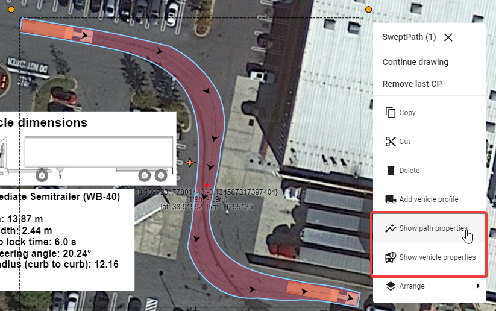

The window will only display the information for each path section and is not yet editable.

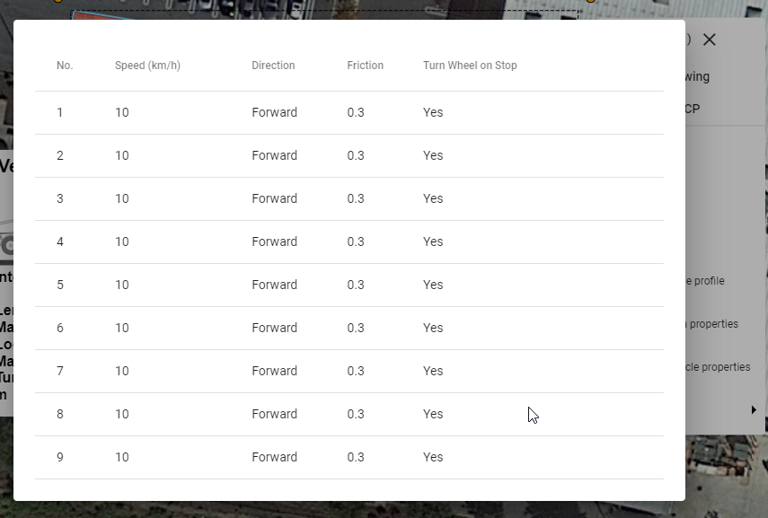

Clicking on **''Show vehicle properties''** will display a window with a breakdown of the vehicle selected in more detail.

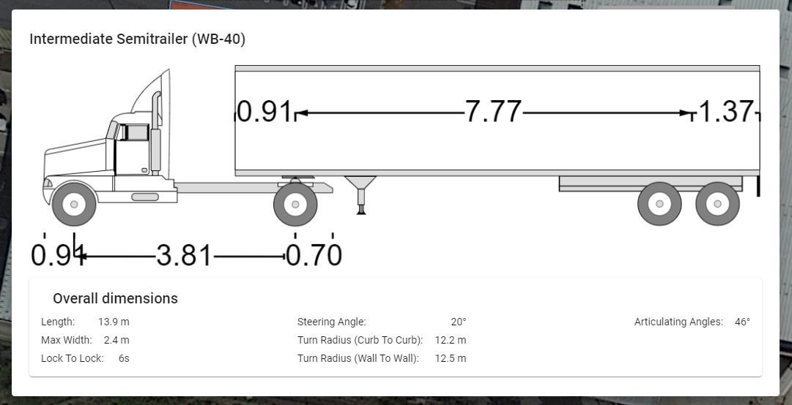
