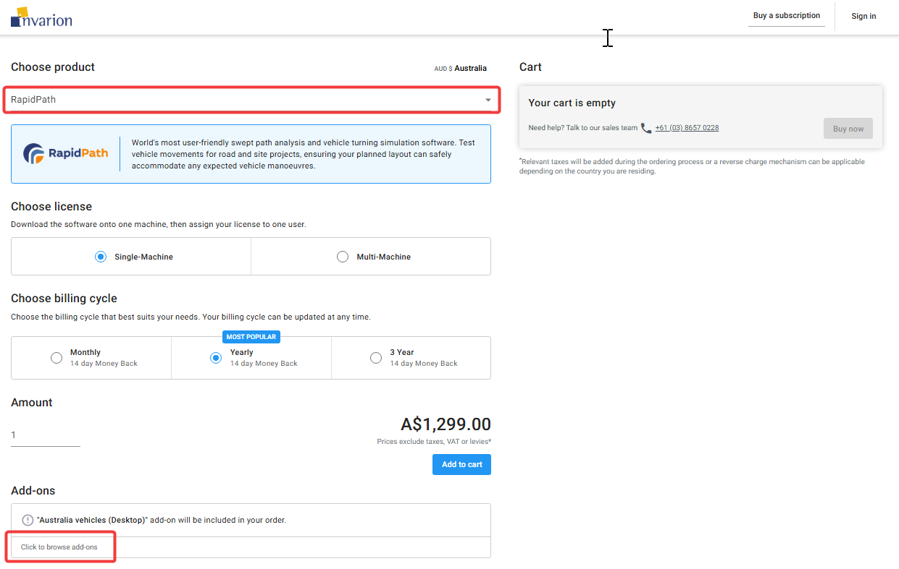
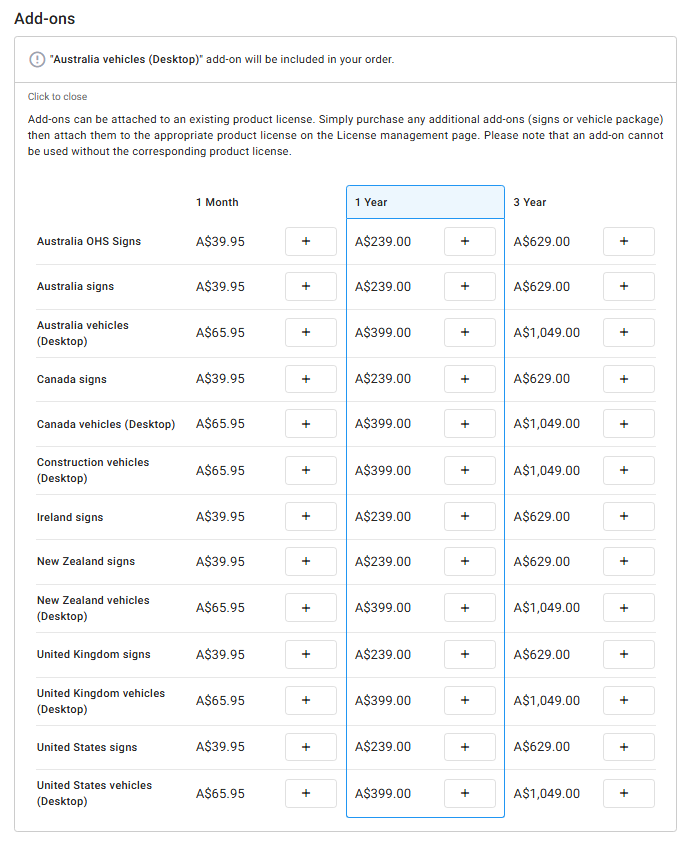

---

sidebar_position: 0

---
# How to Add Signs to RapidPath

**Please note that the advice in this section regarding how to *use* signs assumes that a signs add-on has been purchased for your RapidPath license.**

**Please see the details below explaining how to add signs to RapidPath**

While RapidPlan comes with a signs add-on, RapidPath comes with a vehicles add-on included. If signs are required, you'll first need to purchase the add-on, and then assign it to the appropriate license:

## Purchasing a Signs Add-On

Purchases can be made at [invarion.com](invarion.com). A signs add-on can be purchased at the same time as buying a RapidPath license, or it can be purchased separately later if needed.

To start, click ["Buy Now"](/docs/account-management/buying-a-subscription.md) in the top-right of the Invarion homepage at [invarion.com](invarion.com). This will bring you to a page where you can add subscriptions to your cart.

- In the top-left of this page, toggle *Choose a Product* to *RapidPath*.
- Add RapidPath to your cart *if* you need to purchase it and haven't already.

- Lower on the page, click *Click to Browse Add-Ons* to display the list of add-ons available to purchase for RapidPath.

- Add the signs add-on suited to your region/needs to your cart.
- Proceed with the purchase.

**Note for those adding a signs add-on to a RapidPath license that they have previously purchased:** During the process of purchasing your add-on you will be asked to *Sign In*; please sign in with either the same details used to purchase RapidPath before, or as a listed [administrator](/docs/account-management/managing-company-accounts.md) for the account.

If you need assistance with this process please [let our team know](https://invarion.com/contact/).

## Assigning a Signs Add-On to a RapidPath License

Once a signs add-on is purchased, it will need to be assigned to the intended RapidPath license so that it can be used.

To do so, simply go to [invarion.com](invarion.com) > click *Account* > click *Licenses*.

In the *Licenses* section a list of your licenses will be displayed along with the unassigned add-ons that are available. You'll simply need to click the '*Actions*' button (3 dots) next to the chosen RapidPath license > *Assign Add-On*, and select the relevant signs add-on.

**Note:** Add-ons can't later be removed from a license, please check to make sure you have the right one.
